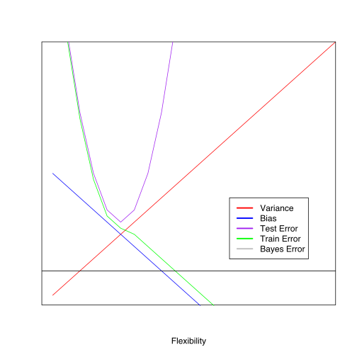
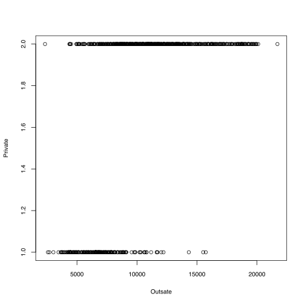
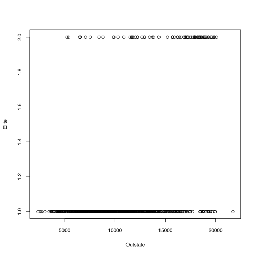
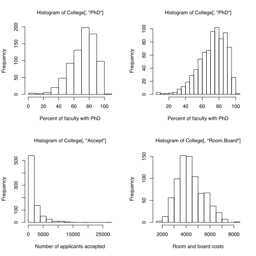
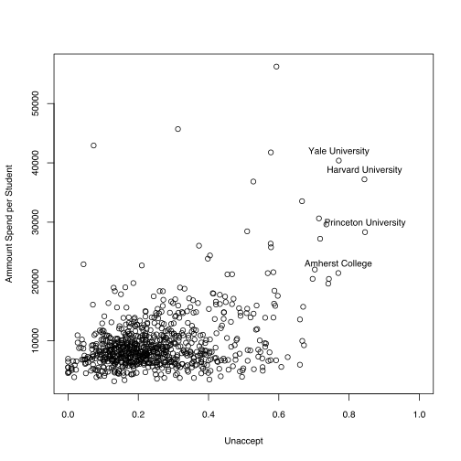
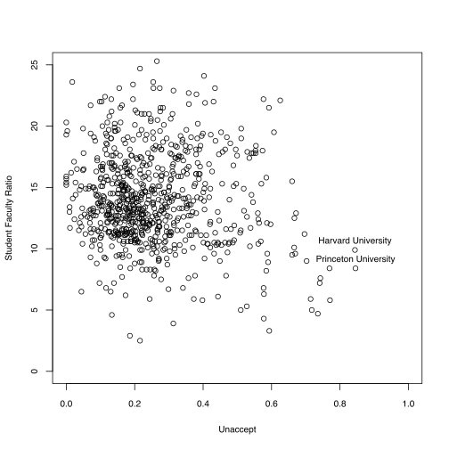
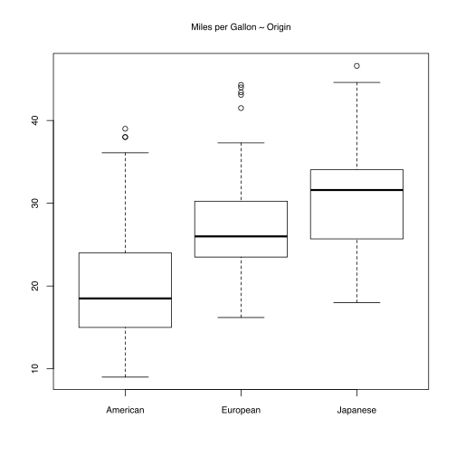
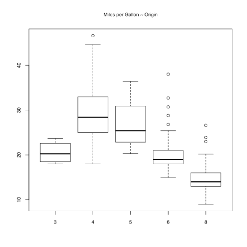
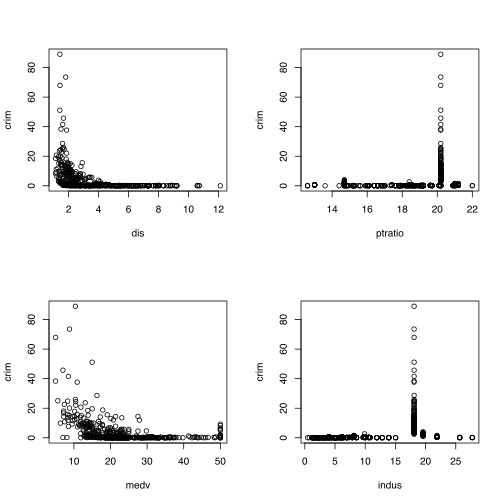
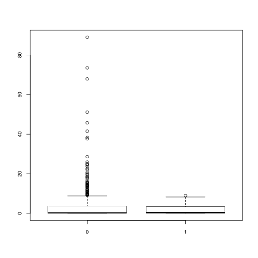

# Introduction to Statistical Learning (ISL)
## Ch 2 Exercises

### Table of Contents
#### Conceptual
- [1](#1)
- [2](#2)
- [3](#3)
- [4](#4)
- [5](#5)
- [6](#6)
- [7](#7)


#### Applied
- [8](#8)
- [9](#9)
- [10](#10)

### 1
#### 1a
For very large number of observations, and a small set of predictors, the variance within each observation is expectedly small. For any predictor p the variance is defined as $Var(p) = \frac{1}{n}\cdot\sum_{i=1}^n(p_i - \mu)^{2}$ where $\mu$ is the mean of p. From this equation one can easily observe that the variance is inverly proportional to n. Thus, I would expect more flexible models to perform better since it would achieve a low bias and not be penalized for a higher variance in the results.

#### 1b
If the number of preditors is *extremely large*, and the number of predictors is small then there is a higher variance associated with the number of predictors. In this case also many machine learning methods are not appliable. For example if there is a larger number of preditors than observations the coefficients in a linear regression model cannot be estimated.


#### 1c
A flexible model will perform better.

#### 1d
A inflexible model will have better performance.

### 2
#### 2a
This is an inference problem because we are interest in which factors affect CEO salary. In this case there are 500 observations and 3 predictor values.

#### 2b
This is a prediction problem. There are 20 observations and 14 preditors.


#### 2c
We are interested in predicting the target variable. There are 3 predictors and the number of observations is the number of weeks in 2012 (52).


### 3
#### 3a


```R
xrange <- 0:10000
bias <- 10-xrange
variance <- xrange
testError <- 6+(xrange-5)^2
trainError <- sapply(xrange,function(x){ if(x<=5) 5.5+(x-5)^2  else 11-x })

plot(xrange,variance,type = "l",xlab="Flexibility",ylab="",xaxt="n",yaxt = "n",col="red",xlim=c(0,20),ylim=c(0,20))
lines(xrange,y = bias,type="l",col="blue")
lines(xrange,y=testError,type="l",col="purple")
lines(xrange,y=trainError,type="l",col="green")
abline(h = 2)

legend(13,8,lty=c(1,1),legend = c("Variance","Bias","Test Error","Train Error","Bayes Error"),lwd=c(2.5,2.5),
       col=c("red","blue","purple","green","gray"))
```





#### 3b
Variance is directly proportional to the increase in flexibility. The relationship between variance and model flexbility is likely non-linear, however here the relationship is represented as linear. This is still a good representation, since it is clear that an increase in flexbility provides an increase in variance. 

Bias has a inversely proportial relationship with flexibility. From the graph this is clearly the case, as flexbility increases there is a linear decrease in bias.

The test error is represented by an 'U' shape curve. This is because in increase in flexibility typically improves model performance initially. Performance only later worsening when the variance produced by flexbilble models not being off set by a decrease in bias.

The train error curve closely follows the test error curve initially, but as flexbility increases this quantity continues to decrease. With high level of flexbility train error can be reduced to zero, but in such cases, the model is overfitted. It provides no insight on the underlying behavior of $\hat{f}$ but instead it models noise.

The bayes error is represented by a horizontal line. This error is the irreducible error. The curve shows the lower bound of modeling error. It can be infered that a model with no training error is typically modeling noise, since it cannot reasonably be lower than the irreducible error (unless there is no variance inherent in the data, which is unlikely).

### 4
#### 4a
In classificational problems the target variagle is typically nominal. Classiying emails into spam or not-spam categories is a tipycall application for classification. Another well known application is if a bank customer is going to default or not default on their loan. However, target variables can also be ordinal. A typical application is rating or score prediction.

#### 4b
There are a wide range of regression products in machine learning. Its applications long predate machine learning, as regression was first used to predict orbits of planets around the sun. Other applications are predicting stock market percent increase and housing prices.

#### 4c
Clustering is an important technique or knowledge discovery. Clustering can be use to provide user suggestions by finding similar customers in a webstore, or movie streaming site. 


### 5
Flexible models make less strict (or none) assumptions about the form of f, while inflexible models have a strong bias in regards to the form of f. 

Flexible models should be preferred when there is a large ammount of data available. This is because is a large ammount of observations is provided then there is a smaller variance associated with the predictors. Moreover, flexible models make better predictive models. 

Inflexible models should be used when the number of observations is small, or it is known that there is a high variance associated with the observations. This type of model is also better at inference.

### 6

Parametric methods makes explicit assumptions about the form of f, while non-parametic methods do not. Parametric methods then suffer from a higher bias, and thus are less flexible than non-parametric methods. This class of model is great for inference since the model provides an expicit relationship between the target variables and the set of predictors.

Non-parametric models then are much more flexible than parametic models, since no form of f is assumed. The goal for this class of model is to estimate f as closely as possible via the observed data. However, they suffer from many disanvantages when compares to parametic methods. Typically more observations are needed (think K-nearest). Moreover, this class of model does not provide an explicit relationship between the target variable and the predictors making non-parametic models harder to interpret.

### 7
#### 7a


```R
train <- data.frame(X1=c(0,2,0,0,-1,1),X2=c(3,0,1,1,0,1),X3=c(0,0,3,2,1,1),Y=c("Red","Red","Red","Green","Green","Red"))
print(train) 
```

      X1 X2 X3     Y
    1  0  3  0   Red
    2  2  0  0   Red
    3  0  1  3   Red
    4  0  1  2 Green
    5 -1  0  1 Green
    6  1  1  1   Red


```R
scores = apply(train[,-4],1,function(x){  sqrt(sum((c(0,0,0)-x)^2)) })
names(scores) = 1:6
print(scores)
```

           1        2        3        4        5        6 
    3.000000 2.000000 3.162278 2.236068 1.414214 1.732051 


#### 7b
The prediction is 5 because it is the point with the smallest euclidean distance from the origin.

#### 7c
Red. In this case the points with the smallest distance are 2, 5, and 6. Since 2 and 6 are both red points then the prediction value in also red.

#### 7d
If the bayes decision boundary is highly non-linear, I would expect the value for K to be small. Small values for K provide a more flexible boundary.

### 8
#### 8a

The data can also be loaded direclty from the ISLR package.


```R
library('ISLR')
?College
```

#### 8b

The fix functions allows the supplied argument to be edited (either data or functions). Here the use of this function is simply for inspection. Other functions such as head are typically more practical for this.

Also, since the data has been loaded from the ISLR library directly, the row names are already set correctly.


```R
head(College[,])
```


<table>
<thead><tr><th></th><th scope=col>Private</th><th scope=col>Apps</th><th scope=col>Accept</th><th scope=col>Enroll</th><th scope=col>Top10perc</th><th scope=col>Top25perc</th><th scope=col>F.Undergrad</th><th scope=col>P.Undergrad</th><th scope=col>Outstate</th><th scope=col>Room.Board</th><th scope=col>Books</th><th scope=col>Personal</th><th scope=col>PhD</th><th scope=col>Terminal</th><th scope=col>S.F.Ratio</th><th scope=col>perc.alumni</th><th scope=col>Expend</th><th scope=col>Grad.Rate</th></tr></thead>
<tbody>
	<tr><th scope=row>Abilene Christian University</th><td>Yes </td><td>1660</td><td>1232</td><td>721 </td><td>23  </td><td>52  </td><td>2885</td><td>537 </td><td>7440</td><td>3300</td><td>450 </td><td>2200</td><td>70  </td><td>78  </td><td>18.1</td><td>12  </td><td>7041</td><td>60  </td></tr>
	<tr><th scope=row>Adelphi University</th><td>Yes  </td><td>2186 </td><td>1924 </td><td>512  </td><td>16   </td><td>29   </td><td>2683 </td><td>1227 </td><td>12280</td><td>6450 </td><td>750  </td><td>1500 </td><td>29   </td><td>30   </td><td>12.2 </td><td>16   </td><td>10527</td><td>56   </td></tr>
	<tr><th scope=row>Adrian College</th><td>Yes  </td><td>1428 </td><td>1097 </td><td>336  </td><td>22   </td><td>50   </td><td>1036 </td><td>99   </td><td>11250</td><td>3750 </td><td>400  </td><td>1165 </td><td>53   </td><td>66   </td><td>12.9 </td><td>30   </td><td>8735 </td><td>54   </td></tr>
	<tr><th scope=row>Agnes Scott College</th><td>Yes  </td><td>417  </td><td>349  </td><td>137  </td><td>60   </td><td>89   </td><td>510  </td><td>63   </td><td>12960</td><td>5450 </td><td>450  </td><td>875  </td><td>92   </td><td>97   </td><td>7.7  </td><td>37   </td><td>19016</td><td>59   </td></tr>
	<tr><th scope=row>Alaska Pacific University</th><td>Yes  </td><td>193  </td><td>146  </td><td>55   </td><td>16   </td><td>44   </td><td>249  </td><td>869  </td><td>7560 </td><td>4120 </td><td>800  </td><td>1500 </td><td>76   </td><td>72   </td><td>11.9 </td><td>2    </td><td>10922</td><td>15   </td></tr>
	<tr><th scope=row>Albertson College</th><td>Yes  </td><td>587  </td><td>479  </td><td>158  </td><td>38   </td><td>62   </td><td>678  </td><td>41   </td><td>13500</td><td>3335 </td><td>500  </td><td>675  </td><td>67   </td><td>73   </td><td>9.4  </td><td>11   </td><td>9727 </td><td>55   </td></tr>
</tbody>
</table>


#### 8c
i. 


```R
summary(College)
```


     Private        Apps           Accept          Enroll       Top10perc    
     No :212   Min.   :   81   Min.   :   72   Min.   :  35   Min.   : 1.00  
     Yes:565   1st Qu.:  776   1st Qu.:  604   1st Qu.: 242   1st Qu.:15.00  
               Median : 1558   Median : 1110   Median : 434   Median :23.00  
               Mean   : 3002   Mean   : 2019   Mean   : 780   Mean   :27.56  
               3rd Qu.: 3624   3rd Qu.: 2424   3rd Qu.: 902   3rd Qu.:35.00  
               Max.   :48094   Max.   :26330   Max.   :6392   Max.   :96.00  
       Top25perc      F.Undergrad     P.Undergrad         Outstate    
     Min.   :  9.0   Min.   :  139   Min.   :    1.0   Min.   : 2340  
     1st Qu.: 41.0   1st Qu.:  992   1st Qu.:   95.0   1st Qu.: 7320  
     Median : 54.0   Median : 1707   Median :  353.0   Median : 9990  
     Mean   : 55.8   Mean   : 3700   Mean   :  855.3   Mean   :10441  
     3rd Qu.: 69.0   3rd Qu.: 4005   3rd Qu.:  967.0   3rd Qu.:12925  
     Max.   :100.0   Max.   :31643   Max.   :21836.0   Max.   :21700  
       Room.Board       Books           Personal         PhD        
     Min.   :1780   Min.   :  96.0   Min.   : 250   Min.   :  8.00  
     1st Qu.:3597   1st Qu.: 470.0   1st Qu.: 850   1st Qu.: 62.00  
     Median :4200   Median : 500.0   Median :1200   Median : 75.00  
     Mean   :4358   Mean   : 549.4   Mean   :1341   Mean   : 72.66  
     3rd Qu.:5050   3rd Qu.: 600.0   3rd Qu.:1700   3rd Qu.: 85.00  
     Max.   :8124   Max.   :2340.0   Max.   :6800   Max.   :103.00  
        Terminal       S.F.Ratio      perc.alumni        Expend     
     Min.   : 24.0   Min.   : 2.50   Min.   : 0.00   Min.   : 3186  
     1st Qu.: 71.0   1st Qu.:11.50   1st Qu.:13.00   1st Qu.: 6751  
     Median : 82.0   Median :13.60   Median :21.00   Median : 8377  
     Mean   : 79.7   Mean   :14.09   Mean   :22.74   Mean   : 9660  
     3rd Qu.: 92.0   3rd Qu.:16.50   3rd Qu.:31.00   3rd Qu.:10830  
     Max.   :100.0   Max.   :39.80   Max.   :64.00   Max.   :56233  
       Grad.Rate     
     Min.   : 10.00  
     1st Qu.: 53.00  
     Median : 65.00  
     Mean   : 65.46  
     3rd Qu.: 78.00  
     Max.   :118.00  


ii.


```R
pairs(College[,1:10])
```


iii.


```R
plot(x=College[,"Outstate"],y=College[,"Private"],xlab="Outsate",ylab="Private")
```





iv.


```R
Elite = rep("No",nrow(College))
Elite[College$Top10perc > 50] = "Yes"
Elite = as.factor(Elite)
College = data.frame(College,Elite)
```


```R
summary(Elite)
```


<dl class=dl-horizontal>
	<dt>No</dt>
		<dd>699</dd>
	<dt>Yes</dt>
		<dd>78</dd>
</dl>


```R
plot(College[,"Outstate"],Elite,xlab="Outstate")
```





v.


```R
par(mfrow = c(2,2))

hist(College[,"PhD"],xlab="Percent of faculty with PhD")
hist(College[,"PhD"],xlab="Percent of faculty with PhD",breaks = 100/5)

hist(College[,"Accept"],xlab="Number of applicants accepted")
hist(College[,"Room.Board"],xlab="Room and board costs")
```





vi.

Subtracting the ammount of accepted students divided by the number of applications from one allows us to produce a quantity that measures the difficulty of acceptance for a particular school. We can then use this quantity to answer questions such as; Do difficult to get into schools invest more per student? Is there a relationship between the faculty and student ratio and this quantity?


```R
Unaccept = apply(College[],1,function(x){ 1- as.numeric(x[3]) / as.numeric(x[2])  })

plot(Unaccept,College[,"Expend"],ylab="Ammount Spend per Student",xlim = c(0,1))
text(Unaccept,College[,"Expend"],labels = ifelse(Unaccept > 0.75,row.names(College),""),pos = 3)

plot(Unaccept,College[,"S.F.Ratio"],ylab="Student Faculty Ratio",xlim = c(0,1),ylim=c(0,25))
text(Unaccept,College[,"S.F.Ratio"],labels = ifelse(Unaccept > 0.78,row.names(College),""),pos = 3)
```








#### 9
##### 9a

The quantitative predictors are displacement,horsepower, weight, acceleration. The remaining ones are qualitative; cylinders, year, origin, name.

##### 9b


```R
dat = apply(Auto[,-c(7,8,9)],2,range)
row.names(dat) = c("Min","Max")
dat
```


<table>
<thead><tr><th></th><th scope=col>mpg</th><th scope=col>cylinders</th><th scope=col>displacement</th><th scope=col>horsepower</th><th scope=col>weight</th><th scope=col>acceleration</th></tr></thead>
<tbody>
	<tr><th scope=row>Min</th><td>   9</td><td>   3</td><td>  68</td><td>  46</td><td>1613</td><td>   8</td></tr>
	<tr><th scope=row>Max</th><td>  46.6</td><td>   8.0</td><td> 455.0</td><td> 230.0</td><td>5140.0</td><td>  24.8</td></tr>
</tbody>
</table>


##### 9c


```R
dat = apply(Auto[,-c(7,8,9)],2,function(x){ c(mean(x),sd(x)) })
row.names(dat) = c("Mean","SD")
dat
```


<table>
<thead><tr><th></th><th scope=col>mpg</th><th scope=col>cylinders</th><th scope=col>displacement</th><th scope=col>horsepower</th><th scope=col>weight</th><th scope=col>acceleration</th></tr></thead>
<tbody>
	<tr><th scope=row>Mean</th><td>  23.445918</td><td>   5.471939</td><td> 194.411990</td><td> 104.469388</td><td>2977.584184</td><td>  15.541327</td></tr>
	<tr><th scope=row>SD</th><td>  7.805007</td><td>  1.705783</td><td>104.644004</td><td> 38.491160</td><td>849.402560</td><td>  2.758864</td></tr>
</tbody>
</table>


##### 9d


```R
dat = apply(Auto[-c(10:85),-c(7,8,9)],2,function(x){ c(range(x),mean(x),sd(x)) })
row.names(dat) = c("Min","Max","Mean","SD")
dat
```


<table>
<thead><tr><th></th><th scope=col>mpg</th><th scope=col>cylinders</th><th scope=col>displacement</th><th scope=col>horsepower</th><th scope=col>weight</th><th scope=col>acceleration</th></tr></thead>
<tbody>
	<tr><th scope=row>Min</th><td>  11.0</td><td>   3.0</td><td>  68.0</td><td>  46.0</td><td>1649.0</td><td>   8.5</td></tr>
	<tr><th scope=row>Max</th><td>  46.6</td><td>   8.0</td><td> 455.0</td><td> 230.0</td><td>4997.0</td><td>  24.8</td></tr>
	<tr><th scope=row>Mean</th><td>  24.404430</td><td>   5.373418</td><td> 187.240506</td><td> 100.721519</td><td>2935.971519</td><td>  15.726899</td></tr>
	<tr><th scope=row>SD</th><td>  7.867283</td><td>  1.654179</td><td> 99.678367</td><td> 35.708853</td><td>811.300208</td><td>  2.693721</td></tr>
</tbody>
</table>


```R
pairs(Auto)
```


```R
boxplot(mpg~origin,data=Auto,names=c("American","European","Japanese"),main="Miles per Gallon ~ Origin")
```





```R
boxplot(mpg~cylinders,data=Auto,main="Miles per Gallon ~ Origin")
```





##### 9f

Any variable, except the number of cylinders and name, seem to be a good predictor in the value of mpg.

#### 10
##### 10a


```R
nrow(Boston) # number of rows.
ncol(Boston) # number of columns.
```


506


14


Inspecting the data shows that each column is a feature, and each row is an observation (Boston suburb).


```R
head(Boston)
```


<table>
<thead><tr><th></th><th scope=col>crim</th><th scope=col>zn</th><th scope=col>indus</th><th scope=col>chas</th><th scope=col>nox</th><th scope=col>rm</th><th scope=col>age</th><th scope=col>dis</th><th scope=col>rad</th><th scope=col>tax</th><th scope=col>ptratio</th><th scope=col>black</th><th scope=col>lstat</th><th scope=col>medv</th></tr></thead>
<tbody>
	<tr><th scope=row>1</th><td>  0.00632</td><td> 18.00000</td><td>  2.31000</td><td>  0.00000</td><td>  0.53800</td><td>  6.57500</td><td> 65.20000</td><td>  4.09000</td><td>  1.00000</td><td>296.00000</td><td> 15.30000</td><td>396.90000</td><td>  4.98000</td><td> 24.00000</td></tr>
	<tr><th scope=row>2</th><td>  0.02731</td><td>  0.00000</td><td>  7.07000</td><td>  0.00000</td><td>  0.46900</td><td>  6.42100</td><td> 78.90000</td><td>  4.96710</td><td>  2.00000</td><td>242.00000</td><td> 17.80000</td><td>396.90000</td><td>  9.14000</td><td> 21.60000</td></tr>
	<tr><th scope=row>3</th><td>  0.02729</td><td>  0.00000</td><td>  7.07000</td><td>  0.00000</td><td>  0.46900</td><td>  7.18500</td><td> 61.10000</td><td>  4.96710</td><td>  2.00000</td><td>242.00000</td><td> 17.80000</td><td>392.83000</td><td>  4.03000</td><td> 34.70000</td></tr>
	<tr><th scope=row>4</th><td>  0.03237</td><td>  0.00000</td><td>  2.18000</td><td>  0.00000</td><td>  0.45800</td><td>  6.99800</td><td> 45.80000</td><td>  6.06220</td><td>  3.00000</td><td>222.00000</td><td> 18.70000</td><td>394.63000</td><td>  2.94000</td><td> 33.40000</td></tr>
	<tr><th scope=row>5</th><td>  0.06905</td><td>  0.00000</td><td>  2.18000</td><td>  0.00000</td><td>  0.45800</td><td>  7.14700</td><td> 54.20000</td><td>  6.06220</td><td>  3.00000</td><td>222.00000</td><td> 18.70000</td><td>396.90000</td><td>  5.33000</td><td> 36.20000</td></tr>
	<tr><th scope=row>6</th><td>  0.02985</td><td>  0.00000</td><td>  2.18000</td><td>  0.00000</td><td>  0.45800</td><td>  6.43000</td><td> 58.70000</td><td>  6.06220</td><td>  3.00000</td><td>222.00000</td><td> 18.70000</td><td>394.12000</td><td>  5.21000</td><td> 28.70000</td></tr>
</tbody>
</table>


##### 10b


```R
par(mfrow = c(2,2))

plot(Boston[,c("dis","crim")])
plot(Boston[,c("ptratio","crim")])
plot(Boston[,c("medv","crim")])
plot(Boston[,c("indus","crim")])
```





```R
boxplot(crim~chas,Boston)
```





##### 10c

There seems to be an association between the median value of owner-occupied homes and crime per capita. Low median value of owner-occupied home indicates a higher crime per capita. 

There is also seem to be a correlation between distance to employment centers and crime. Areas close to employment centers show high crime per capita. 

##### 10d


```R
ranges = apply(Boston,2,range)
row.names(ranges) = c("min","max")
ranges
```


<table>
<thead><tr><th></th><th scope=col>crim</th><th scope=col>zn</th><th scope=col>indus</th><th scope=col>chas</th><th scope=col>nox</th><th scope=col>rm</th><th scope=col>age</th><th scope=col>dis</th><th scope=col>rad</th><th scope=col>tax</th><th scope=col>ptratio</th><th scope=col>black</th><th scope=col>lstat</th><th scope=col>medv</th></tr></thead>
<tbody>
	<tr><th scope=row>min</th><td>  0.00632</td><td>  0.00000</td><td>  0.46000</td><td>  0.00000</td><td>  0.38500</td><td>  3.56100</td><td>  2.90000</td><td>  1.12960</td><td>  1.00000</td><td>187.00000</td><td> 12.60000</td><td>  0.32000</td><td>  1.73000</td><td>  5.00000</td></tr>
	<tr><th scope=row>max</th><td> 88.9762</td><td>100.0000</td><td> 27.7400</td><td>  1.0000</td><td>  0.8710</td><td>  8.7800</td><td>100.0000</td><td> 12.1265</td><td> 24.0000</td><td>711.0000</td><td> 22.0000</td><td>396.9000</td><td> 37.9700</td><td> 50.0000</td></tr>
</tbody>
</table>


##### 10e


```R
selection = Boston[,"chas"]
nrow(Boston[selection,])
```


35


##### 10f


```R
median(Boston[,"ptratio"])
```


19.05


##### 10g


```R
Boston[which.min(Boston[,"medv"]),]
```


<table>
<thead><tr><th></th><th scope=col>crim</th><th scope=col>zn</th><th scope=col>indus</th><th scope=col>chas</th><th scope=col>nox</th><th scope=col>rm</th><th scope=col>age</th><th scope=col>dis</th><th scope=col>rad</th><th scope=col>tax</th><th scope=col>ptratio</th><th scope=col>black</th><th scope=col>lstat</th><th scope=col>medv</th></tr></thead>
<tbody>
	<tr><th scope=row>399</th><td> 38.3518</td><td>  0.0000</td><td> 18.1000</td><td>  0.0000</td><td>  0.6930</td><td>  5.4530</td><td>100.0000</td><td>  1.4896</td><td> 24.0000</td><td>666.0000</td><td> 20.2000</td><td>396.9000</td><td> 30.5900</td><td>  5.0000</td></tr>
</tbody>
</table>


This suburb presents a significant black population, with all houses being built before 1940, and high teacher pupil ratio when comparing to the other observations in the data.

##### 10h


```R
rooms = lapply(1:8,function(x){ sum(Boston[,"rm"] > x) })
rooms
```


<ol>
	<li>506</li>
	<li>506</li>
	<li>506</li>
	<li>504</li>
	<li>490</li>
	<li>333</li>
	<li>64</li>
	<li>13</li>
</ol>


Applying the summary function to observations with more the 8 rooms yields the output below. Straight away one can note that these suburbs have a low crime per capita, and high median home value. 


```R
summary(Boston[Boston[,"rm"] > 8,])
```


          crim               zn            indus             chas       
     Min.   :0.02009   Min.   : 0.00   Min.   : 2.680   Min.   :0.0000  
     1st Qu.:0.33147   1st Qu.: 0.00   1st Qu.: 3.970   1st Qu.:0.0000  
     Median :0.52014   Median : 0.00   Median : 6.200   Median :0.0000  
     Mean   :0.71879   Mean   :13.62   Mean   : 7.078   Mean   :0.1538  
     3rd Qu.:0.57834   3rd Qu.:20.00   3rd Qu.: 6.200   3rd Qu.:0.0000  
     Max.   :3.47428   Max.   :95.00   Max.   :19.580   Max.   :1.0000  
          nox               rm             age             dis       
     Min.   :0.4161   Min.   :8.034   Min.   : 8.40   Min.   :1.801  
     1st Qu.:0.5040   1st Qu.:8.247   1st Qu.:70.40   1st Qu.:2.288  
     Median :0.5070   Median :8.297   Median :78.30   Median :2.894  
     Mean   :0.5392   Mean   :8.349   Mean   :71.54   Mean   :3.430  
     3rd Qu.:0.6050   3rd Qu.:8.398   3rd Qu.:86.50   3rd Qu.:3.652  
     Max.   :0.7180   Max.   :8.780   Max.   :93.90   Max.   :8.907  
          rad              tax           ptratio          black      
     Min.   : 2.000   Min.   :224.0   Min.   :13.00   Min.   :354.6  
     1st Qu.: 5.000   1st Qu.:264.0   1st Qu.:14.70   1st Qu.:384.5  
     Median : 7.000   Median :307.0   Median :17.40   Median :386.9  
     Mean   : 7.462   Mean   :325.1   Mean   :16.36   Mean   :385.2  
     3rd Qu.: 8.000   3rd Qu.:307.0   3rd Qu.:17.40   3rd Qu.:389.7  
     Max.   :24.000   Max.   :666.0   Max.   :20.20   Max.   :396.9  
         lstat           medv     
     Min.   :2.47   Min.   :21.9  
     1st Qu.:3.32   1st Qu.:41.7  
     Median :4.14   Median :48.3  
     Mean   :4.31   Mean   :44.2  
     3rd Qu.:5.12   3rd Qu.:50.0  
     Max.   :7.44   Max.   :50.0  


```R
apply(Boston[rooms,],2,mean) < apply(Boston,2,mean)
```


<dl class=dl-horizontal>
	<dt>crim</dt>
		<dd>TRUE</dd>
	<dt>zn</dt>
		<dd>FALSE</dd>
	<dt>indus</dt>
		<dd>TRUE</dd>
	<dt>chas</dt>
		<dd>FALSE</dd>
	<dt>nox</dt>
		<dd>TRUE</dd>
	<dt>rm</dt>
		<dd>FALSE</dd>
	<dt>age</dt>
		<dd>FALSE</dd>
	<dt>dis</dt>
		<dd>TRUE</dd>
	<dt>rad</dt>
		<dd>TRUE</dd>
	<dt>tax</dt>
		<dd>TRUE</dd>
	<dt>ptratio</dt>
		<dd>TRUE</dd>
	<dt>black</dt>
		<dd>FALSE</dd>
	<dt>lstat</dt>
		<dd>TRUE</dd>
	<dt>medv</dt>
		<dd>FALSE</dd>
</dl>


