# Introduction to Statistical Leaning (ISL)
## Ch 3 Applied Exercises 

## Table of contents


- [1](#1)
- [2](#2)
- [3](#3)
- [4](#4)
- [5](#5)
- [6](#6)
- [7](#7)
- [8](#8)
- [9](#9)
- [10](#10)
- [11](#11)
- [12](#12)
- [13](#13)
- [14](#14)
- [15](#15)


### 1

Each p value in Table 3.4 corresponds to the probability of the respective coe cient being zero. The conclusion drawn is that given the e↵ect of both TV and radio has on sales there is no evidence that newspaper is related to sales.

### 2

Both KNN classifier and KNN regression use information about the neighborhood of data points to draw conclusions from, however each method has unique goals. In the case of KNN classifier we are interested in finding to which class a new data point belongs to, thus we assign it to the class of most frequent point class in the neighborhood of this point. One the other hand, in KNN regression our target is not a class label but rather a real number, so we assign a new point value to the mean of the points in the neighborhood.

### 3

#### 3a
$Female: 85+20\times GPA+0.07\times IQ+0.01\times GPA:IQ-10\times GPA$ 
  
$Male: 50+20\times GPA+0.07\times IQ+0.01\times GPA:IQ$

When GPA is large Females will have a lower salary. The correct alternative is $\textbf{iii}$.

#### 3b
$50+20\times4+0.07\times110+35+0.01\times4*110-10\times 4 = 137.1$

#### 3c
This may not be the case. While the coefficient is small it may have a high t-statistic and thus small p-value implying that an interaction effect exists.

### 4
#### 4a
I would expect the RSS to be lower when fitting cubic linear regression on the training set, since fitting polynomial coefficients would provide a tighter fit to the data.

#### 4b
In the test set the RSS would tend to be higher for the cubic linear model. Since the true relationship is linear the reduction of bias is not offset by a reduction in variance thus RSS is larger for the cubic linear model.

#### 4c
Since the cubic model is more flexible I would expect it to perform well on the training set.

#### 4d
There is not enough information in this case; Depending on how non-linear is the true relationship either model may perform better. In the case the true relationship is non-linear but closer to linear than cubic then the linear model will perform better. The opposite is true when the true relationship is closer to cubic than linear. 


### 5
$a_i = x_i / (\sum x_i^2)$

### 6
A linear model with one predictor is defined by $\hat{y} = \hat{\beta_0} + \hat{\beta_1} x$ and  if $(\bar{y},\bar{x})$ is a point on the line then $\bar{y} = \hat{\beta_0} + \hat{\beta_1} \bar{x}$ then $ \bar{y} - \hat{\beta_1} \bar{x}= \hat{\beta_0}$ which is true by the definition of $\hat{\beta_0}$ on equation 3.4.

### 7
(skipped)

### 8


```R
library(ISLR)
```


```R
summary(Auto)
```


          mpg          cylinders      displacement     horsepower        weight    
     Min.   : 9.00   Min.   :3.000   Min.   : 68.0   Min.   : 46.0   Min.   :1613  
     1st Qu.:17.00   1st Qu.:4.000   1st Qu.:105.0   1st Qu.: 75.0   1st Qu.:2225  
     Median :22.75   Median :4.000   Median :151.0   Median : 93.5   Median :2804  
     Mean   :23.45   Mean   :5.472   Mean   :194.4   Mean   :104.5   Mean   :2978  
     3rd Qu.:29.00   3rd Qu.:8.000   3rd Qu.:275.8   3rd Qu.:126.0   3rd Qu.:3615  
     Max.   :46.60   Max.   :8.000   Max.   :455.0   Max.   :230.0   Max.   :5140  
                                                                                   
      acceleration        year           origin                      name    
     Min.   : 8.00   Min.   :70.00   Min.   :1.000   amc matador       :  5  
     1st Qu.:13.78   1st Qu.:73.00   1st Qu.:1.000   ford pinto        :  5  
     Median :15.50   Median :76.00   Median :1.000   toyota corolla    :  5  
     Mean   :15.54   Mean   :75.98   Mean   :1.577   amc gremlin       :  4  
     3rd Qu.:17.02   3rd Qu.:79.00   3rd Qu.:2.000   amc hornet        :  4  
     Max.   :24.80   Max.   :82.00   Max.   :3.000   chevrolet chevette:  4  
                                                     (Other)           :365  


### 8a


```R
lm.fit <- lm(mpg~horsepower,data = Auto)
summary(lm.fit)
```


    
    Call:
    lm(formula = mpg ~ horsepower, data = Auto)
    
    Residuals:
         Min       1Q   Median       3Q      Max 
    -13.5710  -3.2592  -0.3435   2.7630  16.9240 
    
    Coefficients:
                 Estimate Std. Error t value Pr(>|t|)    
    (Intercept) 39.935861   0.717499   55.66   <2e-16 ***
    horsepower  -0.157845   0.006446  -24.49   <2e-16 ***
    ---
    Signif. codes:  0 ‘***’ 0.001 ‘**’ 0.01 ‘*’ 0.05 ‘.’ 0.1 ‘ ’ 1
    
    Residual standard error: 4.906 on 390 degrees of freedom
    Multiple R-squared:  0.6059,	Adjusted R-squared:  0.6049 
    F-statistic: 599.7 on 1 and 390 DF,  p-value: < 2.2e-16


#### i. 
A relationship between the predictor and response exists as can be seen using the F-statistic of the model or the p-value associated with horsepower (thus the null hypothesis can be refuted in this case).

#### ii.
The streng can be measured by how well does the predictor explain the variance in the data. Thus using the R-squared statistic we can see that about 60% of the variance in mpg is explained by horsepower. 


```R
floor(summary(lm.fit)$r.sq*100)
```


60


Alternatively, RSE can be used as a measure of strenght of the relationship. RSE measures the standard deviation from the population regression line (this can be interpreted as the lack of fit of the model). This indicates then a percentage error of about 20%.


```R
floor(summary(lm.fit)$sigma/mean(Auto[["mpg"]])*100)
```


20


#### iii.

The relationship is negative as can be seen by the coefficient of horsepower.

#### iv.


```R
predict(lm.fit, data.frame(horsepower=c(98)), interval="confidence")
predict(lm.fit, data.frame(horsepower=c(98)), interval="prediction")
```


<table>
<thead><tr><th></th><th scope=col>fit</th><th scope=col>lwr</th><th scope=col>upr</th></tr></thead>
<tbody>
	<tr><th scope=row>1</th><td>24.46708</td><td>23.97308</td><td>24.96108</td></tr>
</tbody>
</table>


<table>
<thead><tr><th></th><th scope=col>fit</th><th scope=col>lwr</th><th scope=col>upr</th></tr></thead>
<tbody>
	<tr><th scope=row>1</th><td>24.46708</td><td>14.80940</td><td>34.12476</td></tr>
</tbody>
</table>


#### b


```R
plot(Auto[["horsepower"]],Auto[["mpg"]],xlab="horsepower",ylab="mpg")+abline(coef(lm.fit),col="red")
```


<ol class=list-inline>
</ol>


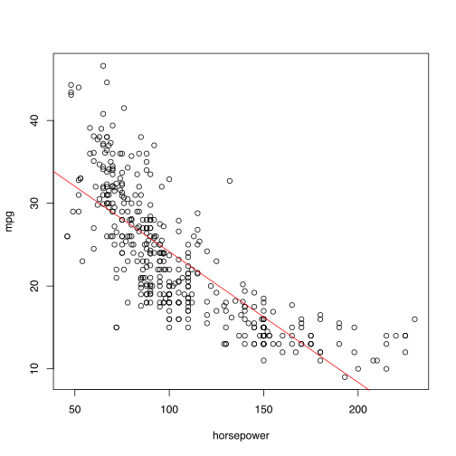


#### c


```R
par(mfrow = c(2,2))
plot(lm.fit)
```


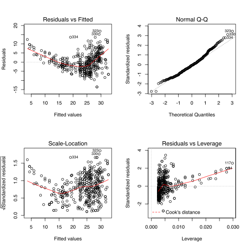


From the plots above it is easy to notice that there is evident of non-linearity. It is also possible to spot possible outliers and points with high leverage. 


```R
plot(predict(lm.fit),rstudent(lm.fit),col=ifelse(rstudent(lm.fit)>=3,"red","black"))+
text(predict(lm.fit),rstudent(lm.fit),labels=ifelse(rstudent(lm.fit)>=2.5,names(which(rstudent(lm.fit)>=3)),""),pos=4)

plot(hatvalues(lm.fit),col=ifelse(hatvalues(lm.fit)>0.028,"red","black"))+
text(hatvalues(lm.fit),labels=ifelse(hatvalues(lm.fit)>0.028,names(which.max(hatvalues(lm.fit)>0.028)),""), cex= 0.7,pos=4)
```


<ol class=list-inline>
</ol>


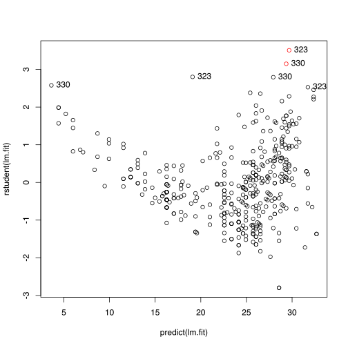


<ol class=list-inline>
</ol>


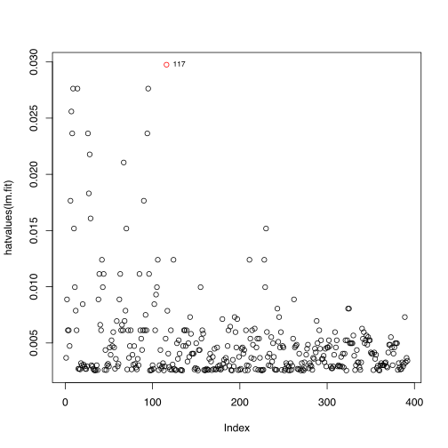


### 9

#### 9a


```R
#pairs(~.,data = Auto)
```

#### 9b


```R
cor(Auto[,-9])
```


<table>
<thead><tr><th></th><th scope=col>mpg</th><th scope=col>cylinders</th><th scope=col>displacement</th><th scope=col>horsepower</th><th scope=col>weight</th><th scope=col>acceleration</th><th scope=col>year</th><th scope=col>origin</th></tr></thead>
<tbody>
	<tr><th scope=row>mpg</th><td> 1.0000000</td><td>-0.7776175</td><td>-0.8051269</td><td>-0.7784268</td><td>-0.8322442</td><td> 0.4233285</td><td> 0.5805410</td><td> 0.5652088</td></tr>
	<tr><th scope=row>cylinders</th><td>-0.7776175</td><td> 1.0000000</td><td> 0.9508233</td><td> 0.8429834</td><td> 0.8975273</td><td>-0.5046834</td><td>-0.3456474</td><td>-0.5689316</td></tr>
	<tr><th scope=row>displacement</th><td>-0.8051269</td><td> 0.9508233</td><td> 1.0000000</td><td> 0.8972570</td><td> 0.9329944</td><td>-0.5438005</td><td>-0.3698552</td><td>-0.6145351</td></tr>
	<tr><th scope=row>horsepower</th><td>-0.7784268</td><td> 0.8429834</td><td> 0.8972570</td><td> 1.0000000</td><td> 0.8645377</td><td>-0.6891955</td><td>-0.4163615</td><td>-0.4551715</td></tr>
	<tr><th scope=row>weight</th><td>-0.8322442</td><td> 0.8975273</td><td> 0.9329944</td><td> 0.8645377</td><td> 1.0000000</td><td>-0.4168392</td><td>-0.3091199</td><td>-0.5850054</td></tr>
	<tr><th scope=row>acceleration</th><td> 0.4233285</td><td>-0.5046834</td><td>-0.5438005</td><td>-0.6891955</td><td>-0.4168392</td><td> 1.0000000</td><td> 0.2903161</td><td> 0.2127458</td></tr>
	<tr><th scope=row>year</th><td> 0.5805410</td><td>-0.3456474</td><td>-0.3698552</td><td>-0.4163615</td><td>-0.3091199</td><td> 0.2903161</td><td> 1.0000000</td><td> 0.1815277</td></tr>
	<tr><th scope=row>origin</th><td> 0.5652088</td><td>-0.5689316</td><td>-0.6145351</td><td>-0.4551715</td><td>-0.5850054</td><td> 0.2127458</td><td> 0.1815277</td><td> 1.0000000</td></tr>
</tbody>
</table>


#### 9c


```R
lm.fit <- lm(mpg~.-name,data=Auto)
summary(lm.fit)
```


    
    Call:
    lm(formula = mpg ~ . - name, data = Auto)
    
    Residuals:
        Min      1Q  Median      3Q     Max 
    -9.5903 -2.1565 -0.1169  1.8690 13.0604 
    
    Coefficients:
                   Estimate Std. Error t value Pr(>|t|)    
    (Intercept)  -17.218435   4.644294  -3.707  0.00024 ***
    cylinders     -0.493376   0.323282  -1.526  0.12780    
    displacement   0.019896   0.007515   2.647  0.00844 ** 
    horsepower    -0.016951   0.013787  -1.230  0.21963    
    weight        -0.006474   0.000652  -9.929  < 2e-16 ***
    acceleration   0.080576   0.098845   0.815  0.41548    
    year           0.750773   0.050973  14.729  < 2e-16 ***
    origin         1.426141   0.278136   5.127 4.67e-07 ***
    ---
    Signif. codes:  0 ‘***’ 0.001 ‘**’ 0.01 ‘*’ 0.05 ‘.’ 0.1 ‘ ’ 1
    
    Residual standard error: 3.328 on 384 degrees of freedom
    Multiple R-squared:  0.8215,	Adjusted R-squared:  0.8182 
    F-statistic: 252.4 on 7 and 384 DF,  p-value: < 2.2e-16


##### i
There is a relationship between the predictors and the response, which can be seen by the F-statistic much larger than 1.

##### ii
By order of p-values; year, weight, origin, displacement. The other values do not have a significant relationship at the 95% confidence level.

##### iii
The coefficient of year suggests that mpg is improved upon by car makers every year.

#### 9d


```R
par(mfrow = c(2,2))
plot(lm.fit)
```


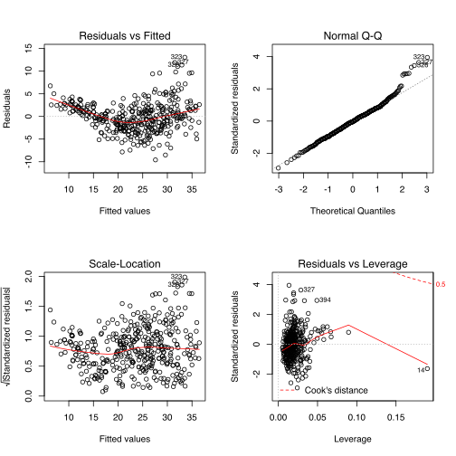


The diagnostic plots identify a few large outliers, entries 326, 227 and 323. Also, points with high leverage are identified. These points are 327, and 394. 327 is then a point with a high leverage and also an outlier.

#### 9e


```R
lm.fit <- lm(mpg~.*.-name*.+.-name,data=Auto)
summary(lm.fit)
```


    
    Call:
    lm(formula = mpg ~ . * . - name * . + . - name, data = Auto)
    
    Residuals:
        Min      1Q  Median      3Q     Max 
    -7.6303 -1.4481  0.0596  1.2739 11.1386 
    
    Coefficients:
                                Estimate Std. Error t value Pr(>|t|)   
    (Intercept)                3.548e+01  5.314e+01   0.668  0.50475   
    cylinders                  6.989e+00  8.248e+00   0.847  0.39738   
    displacement              -4.785e-01  1.894e-01  -2.527  0.01192 * 
    horsepower                 5.034e-01  3.470e-01   1.451  0.14769   
    weight                     4.133e-03  1.759e-02   0.235  0.81442   
    acceleration              -5.859e+00  2.174e+00  -2.696  0.00735 **
    year                       6.974e-01  6.097e-01   1.144  0.25340   
    origin                    -2.090e+01  7.097e+00  -2.944  0.00345 **
    cylinders:displacement    -3.383e-03  6.455e-03  -0.524  0.60051   
    cylinders:horsepower       1.161e-02  2.420e-02   0.480  0.63157   
    cylinders:weight           3.575e-04  8.955e-04   0.399  0.69000   
    cylinders:acceleration     2.779e-01  1.664e-01   1.670  0.09584 . 
    cylinders:year            -1.741e-01  9.714e-02  -1.793  0.07389 . 
    cylinders:origin           4.022e-01  4.926e-01   0.816  0.41482   
    displacement:horsepower   -8.491e-05  2.885e-04  -0.294  0.76867   
    displacement:weight        2.472e-05  1.470e-05   1.682  0.09342 . 
    displacement:acceleration -3.479e-03  3.342e-03  -1.041  0.29853   
    displacement:year          5.934e-03  2.391e-03   2.482  0.01352 * 
    displacement:origin        2.398e-02  1.947e-02   1.232  0.21875   
    horsepower:weight         -1.968e-05  2.924e-05  -0.673  0.50124   
    horsepower:acceleration   -7.213e-03  3.719e-03  -1.939  0.05325 . 
    horsepower:year           -5.838e-03  3.938e-03  -1.482  0.13916   
    horsepower:origin          2.233e-03  2.930e-02   0.076  0.93931   
    weight:acceleration        2.346e-04  2.289e-04   1.025  0.30596   
    weight:year               -2.245e-04  2.127e-04  -1.056  0.29182   
    weight:origin             -5.789e-04  1.591e-03  -0.364  0.71623   
    acceleration:year          5.562e-02  2.558e-02   2.174  0.03033 * 
    acceleration:origin        4.583e-01  1.567e-01   2.926  0.00365 **
    year:origin                1.393e-01  7.399e-02   1.882  0.06062 . 
    ---
    Signif. codes:  0 ‘***’ 0.001 ‘**’ 0.01 ‘*’ 0.05 ‘.’ 0.1 ‘ ’ 1
    
    Residual standard error: 2.695 on 363 degrees of freedom
    Multiple R-squared:  0.8893,	Adjusted R-squared:  0.8808 
    F-statistic: 104.2 on 28 and 363 DF,  p-value: < 2.2e-16


When fitting with all preditors plus all possible interaction terms very few interactions appear statistically significant at 5% level. The significant ones are <font color='red'>acceleration:origin</font>  and <font color='red'>displacement:year</font>.


#### 9f

From previous experiments it is clear to see that there is a non-linear relationship between mpg and horsepower.


```R
lm.fit1 <- lm(mpg~horsepower+I(horsepower^2),data = Auto)
summary(lm.fit1)


bnd <- seq(0,300,0.1)
counts <- predict(lm.fit1, data.frame(horsepower=c(bnd),horsepower2=c(bnd^2)))

plot(Auto[["horsepower"]],Auto[["mpg"]],xlab="horsepower",ylab="mpg")+ lines(bnd,counts,col="red")
```


    
    Call:
    lm(formula = mpg ~ horsepower + I(horsepower^2), data = Auto)
    
    Residuals:
         Min       1Q   Median       3Q      Max 
    -14.7135  -2.5943  -0.0859   2.2868  15.8961 
    
    Coefficients:
                      Estimate Std. Error t value Pr(>|t|)    
    (Intercept)     56.9000997  1.8004268   31.60   <2e-16 ***
    horsepower      -0.4661896  0.0311246  -14.98   <2e-16 ***
    I(horsepower^2)  0.0012305  0.0001221   10.08   <2e-16 ***
    ---
    Signif. codes:  0 ‘***’ 0.001 ‘**’ 0.01 ‘*’ 0.05 ‘.’ 0.1 ‘ ’ 1
    
    Residual standard error: 4.374 on 389 degrees of freedom
    Multiple R-squared:  0.6876,	Adjusted R-squared:  0.686 
    F-statistic:   428 on 2 and 389 DF,  p-value: < 2.2e-16


<ol class=list-inline>
</ol>


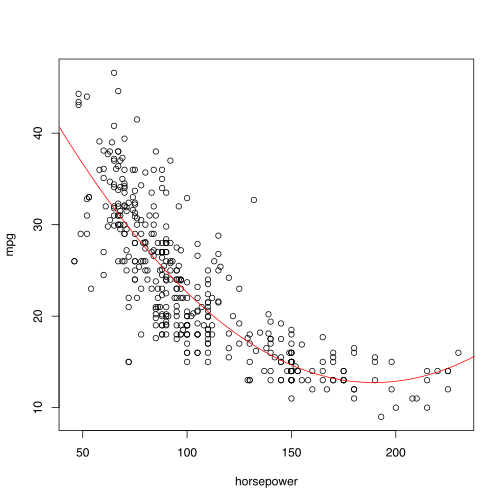


When regressing <font color='red'>mpg</font> onto <font color='red'>weight</font> it is noticible that the residuals present a nonlinear relationship, and some indication of heteroscedasticity (seen by a funnel like shape of the residuals). These indicate that transformations such as log X or sqr(X) may provide a better fit by shrinkinge of large values. 

You can observe below that the funnel like shape is significant reduced when comparing the linear residual plot and the log transform plot.


```R
lm.fit2 <- lm(mpg~I(weight^(1/2)),data = Auto)
lm.fit3 <- lm(mpg~log(weight),data = Auto)
lm.fit4 <- lm(mpg~weight,data = Auto)

bnd <- seq(0,6000,0.1)
counts1 <- predict(lm.fit2,data.frame(weight=bnd))
counts2 <- predict(lm.fit3,data.frame(weight=bnd))
counts3 <- predict(lm.fit4,data.frame(weight=bnd))


par(mfrow=c(2,2))
plot(lm.fit4)

plot(lm.fit3)

par(mfrow=c(1,1))

plot(Auto[["weight"]],Auto[["mpg"]],xlab="weight",ylab="mpg")+lines(bnd,counts1,col="red")+
lines(bnd,counts1,col="blue",lty=2)+lines(bnd,counts3,col="green",lty=3)
```


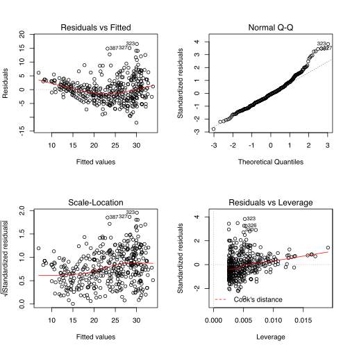


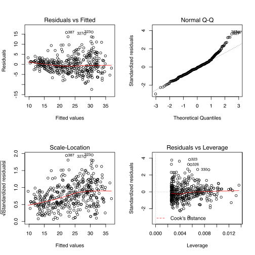


<ol class=list-inline>
</ol>


### 10

#### 10a


```R
library(ISLR)
?Carseats
summary(Carseats)


lm.fit <- lm(Sales~Price+Urban+US,data=Carseats)
summary(lm.fit)
```


<table width="100%" summary="page for Carseats {ISLR}"><tr><td>Carseats {ISLR}</td><td style="text-align: right;">R Documentation</td></tr></table>

<h2>Sales of Child Car Seats

</h2>

<h3>Description</h3>

<p>A simulated data set containing sales of child car seats at
400 different stores.

</p>


<h3>Usage</h3>

<pre>Carseats</pre>


<h3>Format</h3>

<p>A data frame with 400 observations on the following 11 variables.
</p>

<dl>
<dt><code>Sales</code></dt><dd><p>Unit sales (in thousands) at each location</p>
</dd>
<dt><code>CompPrice</code></dt><dd><p>Price charged by competitor at each location</p>
</dd>
<dt><code>Income</code></dt><dd><p>Community income level (in thousands of dollars)</p>
</dd>
<dt><code>Advertising</code></dt><dd><p>Local advertising budget for company at
each location (in thousands of dollars)</p>
</dd>
<dt><code>Population</code></dt><dd><p>Population size in region (in thousands)</p>
</dd>
<dt><code>Price</code></dt><dd><p>Price company charges for car seats at each site</p>
</dd>
<dt><code>ShelveLoc</code></dt><dd><p>A factor with levels <code>Bad</code>, <code>Good</code>
and <code>Medium</code> indicating the quality of the shelving location
for the car seats at each site</p>
</dd>
<dt><code>Age</code></dt><dd><p>Average age of the local population</p>
</dd>
<dt><code>Education</code></dt><dd><p>Education level at each location</p>
</dd>
<dt><code>Urban</code></dt><dd><p>A factor with levels <code>No</code> and <code>Yes</code> to
indicate whether the store is in an urban or rural location</p>
</dd>
<dt><code>US</code></dt><dd><p>A factor with levels <code>No</code> and <code>Yes</code> to
indicate whether the store is in the US or not</p>
</dd>
</dl>


<h3>Source</h3>

<p>Simulated data

</p>


<h3>References</h3>

<p>Games, G., Witten, D., Hastie, T., and Tibshirani, R. (2013)
<em>An Introduction to Statistical Learning with applications in R</em>,
<a href="www.StatLearning.com">www.StatLearning.com</a>,
Springer-Verlag, New York
</p>


<h3>Examples</h3>

<pre>
summary(Carseats)
lm.fit=lm(Sales~Advertising+Price,data=Carseats)
</pre>

<hr /><div style="text-align: center;">[Package <em>ISLR</em> version 1.0 ]</div>


         Sales          CompPrice       Income        Advertising    
     Min.   : 0.000   Min.   : 77   Min.   : 21.00   Min.   : 0.000  
     1st Qu.: 5.390   1st Qu.:115   1st Qu.: 42.75   1st Qu.: 0.000  
     Median : 7.490   Median :125   Median : 69.00   Median : 5.000  
     Mean   : 7.496   Mean   :125   Mean   : 68.66   Mean   : 6.635  
     3rd Qu.: 9.320   3rd Qu.:135   3rd Qu.: 91.00   3rd Qu.:12.000  
     Max.   :16.270   Max.   :175   Max.   :120.00   Max.   :29.000  
       Population        Price        ShelveLoc        Age          Education   
     Min.   : 10.0   Min.   : 24.0   Bad   : 96   Min.   :25.00   Min.   :10.0  
     1st Qu.:139.0   1st Qu.:100.0   Good  : 85   1st Qu.:39.75   1st Qu.:12.0  
     Median :272.0   Median :117.0   Medium:219   Median :54.50   Median :14.0  
     Mean   :264.8   Mean   :115.8                Mean   :53.32   Mean   :13.9  
     3rd Qu.:398.5   3rd Qu.:131.0                3rd Qu.:66.00   3rd Qu.:16.0  
     Max.   :509.0   Max.   :191.0                Max.   :80.00   Max.   :18.0  
     Urban       US     
     No :118   No :142  
     Yes:282   Yes:258  
                        
                        
                        
                        


    
    Call:
    lm(formula = Sales ~ Price + Urban + US, data = Carseats)
    
    Residuals:
        Min      1Q  Median      3Q     Max 
    -6.9206 -1.6220 -0.0564  1.5786  7.0581 
    
    Coefficients:
                 Estimate Std. Error t value Pr(>|t|)    
    (Intercept) 13.043469   0.651012  20.036  < 2e-16 ***
    Price       -0.054459   0.005242 -10.389  < 2e-16 ***
    UrbanYes    -0.021916   0.271650  -0.081    0.936    
    USYes        1.200573   0.259042   4.635 4.86e-06 ***
    ---
    Signif. codes:  0 ‘***’ 0.001 ‘**’ 0.01 ‘*’ 0.05 ‘.’ 0.1 ‘ ’ 1
    
    Residual standard error: 2.472 on 396 degrees of freedom
    Multiple R-squared:  0.2393,	Adjusted R-squared:  0.2335 
    F-statistic: 41.52 on 3 and 396 DF,  p-value: < 2.2e-16


#### 10b

There are 3 coefficients in this model; Price, UrbanYes, and USYes. For every one unit increase of Price, the average Sales of a carseat decreases by about 0.05. Since UrbanYes is a qualitative variable it can be interpreted as average difference increase of Sales of a store located in a rural zone or urban zone, holding all other predictors constant. However, since be p-value there is not enough information to tell this relationship is present in the data given the other predictors. Lastly, the USYes coefficient can be interpreted as the average increase in Sales provided that the store is located in the United States. Thus there is an average increase of about 1200 units of sales in the US compared to carseat sales elsewhere.

#### 10c
This model produces several parallel lines for the different qualitative values.

	
$\hat{y}=-0.05\times x+ \begin{cases} 
      13.04 & UrbanYes=0,USYes=0 \\
      13.02 & UrbanYes=1,USYes=0 \\
      14.24 & UrbanYes=0,USYes=1 \\
      14.22 & UrbanYes=1,USYes=1
   \end{cases}
$

#### 10d
The null hypothesis can be rejected for <font color='red'>USYes</font> and <font color='red'>Price</font>.

#### 10e


```R
lm.fit <- lm(Sales~Price+US,,data=Carseats)
summary(lm.fit)
```


    
    Call:
    lm(formula = Sales ~ Price + US, data = Carseats)
    
    Residuals:
        Min      1Q  Median      3Q     Max 
    -6.9269 -1.6286 -0.0574  1.5766  7.0515 
    
    Coefficients:
                Estimate Std. Error t value Pr(>|t|)    
    (Intercept) 13.03079    0.63098  20.652  < 2e-16 ***
    Price       -0.05448    0.00523 -10.416  < 2e-16 ***
    USYes        1.19964    0.25846   4.641 4.71e-06 ***
    ---
    Signif. codes:  0 ‘***’ 0.001 ‘**’ 0.01 ‘*’ 0.05 ‘.’ 0.1 ‘ ’ 1
    
    Residual standard error: 2.469 on 397 degrees of freedom
    Multiple R-squared:  0.2393,	Adjusted R-squared:  0.2354 
    F-statistic: 62.43 on 2 and 397 DF,  p-value: < 2.2e-16


#### 10f
Both models fit the data equally well, with the second model having a slightly lower RSE error. 

#### 10g


```R
confint(lm.fit)
```


<table>
<thead><tr><th></th><th scope=col>2.5 %</th><th scope=col>97.5 %</th></tr></thead>
<tbody>
	<tr><th scope=row>(Intercept)</th><td>11.79032</td><td>14.27127</td></tr>
	<tr><th scope=row>Price</th><td>-0.06475984</td><td>-0.04419543</td></tr>
	<tr><th scope=row>USYes</th><td>0.6915196</td><td>1.7077663</td></tr>
</tbody>
</table>


#### 10h

As noted from the the plots below there is no evidence of outliers but there are points with high leverage.


```R
plot(predict(lm.fit),rstudent(lm.fit),col=ifelse(rstudent(lm.fit)>3,"red","black"))
plot(hatvalues(lm.fit),col=ifelse(hatvalues(lm.fit)>(2+1)/dim(Carseats)[1]*3,"red","black"))
```


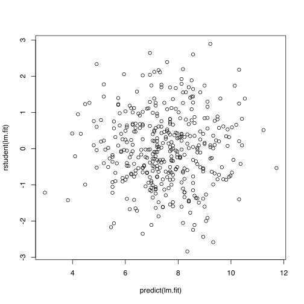


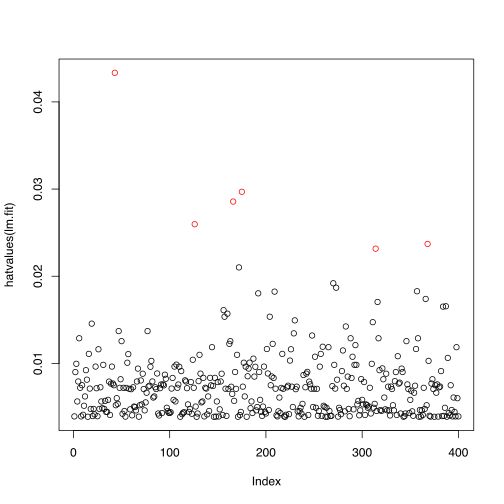


### 11


```R
set.seed(1)
x=rnorm(100)
y=2*x+rnorm(100)
```

#### 11a


```R
lm.fit1 <- lm(y~x+0)

summary(lm.fit1)
```


    
    Call:
    lm(formula = y ~ x + 0)
    
    Residuals:
        Min      1Q  Median      3Q     Max 
    -1.9154 -0.6472 -0.1771  0.5056  2.3109 
    
    Coefficients:
      Estimate Std. Error t value Pr(>|t|)    
    x   1.9939     0.1065   18.73   <2e-16 ***
    ---
    Signif. codes:  0 ‘***’ 0.001 ‘**’ 0.01 ‘*’ 0.05 ‘.’ 0.1 ‘ ’ 1
    
    Residual standard error: 0.9586 on 99 degrees of freedom
    Multiple R-squared:  0.7798,	Adjusted R-squared:  0.7776 
    F-statistic: 350.7 on 1 and 99 DF,  p-value: < 2.2e-16


The null hypothesis can be refuted for this model due to both high F-statistic and low p-values.

#### 11b


```R
lm.fit2 <- lm(x~y)
summary(lm.fit2)
```


    
    Call:
    lm(formula = x ~ y)
    
    Residuals:
         Min       1Q   Median       3Q      Max 
    -0.90848 -0.28101  0.06274  0.24570  0.85736 
    
    Coefficients:
                Estimate Std. Error t value Pr(>|t|)    
    (Intercept)  0.03880    0.04266    0.91    0.365    
    y            0.38942    0.02099   18.56   <2e-16 ***
    ---
    Signif. codes:  0 ‘***’ 0.001 ‘**’ 0.01 ‘*’ 0.05 ‘.’ 0.1 ‘ ’ 1
    
    Residual standard error: 0.4249 on 98 degrees of freedom
    Multiple R-squared:  0.7784,	Adjusted R-squared:  0.7762 
    F-statistic: 344.3 on 1 and 98 DF,  p-value: < 2.2e-16


The null hypothesis cannot be refuted in this step because of the p-value of the intercept being high.

#### 11b

$\hat{\beta}=(\sum_{i=1}^{n}x_{i}y_{i})/(\sum_{i'=1}^{n}x_{i'}^{2})$

$SE(\hat{\beta}) = \sqrt{ \frac{\sum_{i=1}^{n}(y_{i}-x_{i}\hat{\beta})^{2}}{(n-1)\sum_{i'=1}^{n}x_{i'}^{2}}}$

$t-statistic = \frac{\hat{\beta}}{SE(\hat{\beta})} = \frac{(\sum_{i=1}^{n}x_{i}y_{i})/(\sum_{i'=1}^{n}x_{i'}^{2})}{\sqrt{ \frac{\sum_{i=1}^{n}(y_{i}-x_{i}\hat{\beta})^{2}}{(n-1)\sum_{i'=1}^{n}x_{i'}^{2}}}}$

$= \frac{\sum_{i=1}^{n}x_{i}y_{i}\sqrt{n-1}}{\sum_{i=1}^{n}(y_{i}-x_{i}\hat{\beta})^{2}}\frac{1}{\sum_{i'}^{n}x_{i'}^{2}} = \frac{\sum_{i=1}^{n}x_{i}y_{i}\sqrt{n-1}}{\sum_{i=1}^{n}y_i^{2}-2y_{i}x_{i}\hat{\beta}+x_{i}^{2}\hat{\beta}^{2}}\frac{1}{\sum_{i'}^{n}x_{i'}^{2}} = \frac{\sum_{i=1}^{n}x_{i}y_{i}\sqrt{n-1}}{\sqrt{(\sum_{i'=1}^{n}x_{i'}^{2})(\sum_{i'=1}^{n}y_{i'}^{2})-(\sum_{i'=1}^{n}x_{i'}y_{i'})^{2}  }}$

Since,

$(-2\sum_{i'}^{n}y_{i'}x_{i'}\hat{\beta}+\sum_{i'}^{n}x_{i'}^{2}\hat{\beta}^{2})(\sum_{i'}^{n}x_{i'}^{2}) = -2\sum_{i'}^{n}y_{i}x_{i}(\sum_{i=1}^{n}x_{i}y_{i}) +(\sum_{i=1}^{n}x_{i}y_{i})^{2} = -(\sum_{i=1}^{n}x_{i}y_{i})^{2} $


#### 11c
Since no intercept is present, both equations simplify to the same one.

#### 11f


```R
lm.fit1 <- lm(x~y+0)
summary(lm.fit1)

lm.fit2 <- lm(y~x+0)
summary(lm.fit2)
```


    
    Call:
    lm(formula = x ~ y + 0)
    
    Residuals:
        Min      1Q  Median      3Q     Max 
    -0.8699 -0.2368  0.1030  0.2858  0.8938 
    
    Coefficients:
      Estimate Std. Error t value Pr(>|t|)    
    y  0.39111    0.02089   18.73   <2e-16 ***
    ---
    Signif. codes:  0 ‘***’ 0.001 ‘**’ 0.01 ‘*’ 0.05 ‘.’ 0.1 ‘ ’ 1
    
    Residual standard error: 0.4246 on 99 degrees of freedom
    Multiple R-squared:  0.7798,	Adjusted R-squared:  0.7776 
    F-statistic: 350.7 on 1 and 99 DF,  p-value: < 2.2e-16


    
    Call:
    lm(formula = y ~ x + 0)
    
    Residuals:
        Min      1Q  Median      3Q     Max 
    -1.9154 -0.6472 -0.1771  0.5056  2.3109 
    
    Coefficients:
      Estimate Std. Error t value Pr(>|t|)    
    x   1.9939     0.1065   18.73   <2e-16 ***
    ---
    Signif. codes:  0 ‘***’ 0.001 ‘**’ 0.01 ‘*’ 0.05 ‘.’ 0.1 ‘ ’ 1
    
    Residual standard error: 0.9586 on 99 degrees of freedom
    Multiple R-squared:  0.7798,	Adjusted R-squared:  0.7776 
    F-statistic: 350.7 on 1 and 99 DF,  p-value: < 2.2e-16


### 12

#### 12a
The coefficient will be the same when $\sum_{i}^{n}x_i^2 = \sum_{i}^{n}y_i^2 $

#### 12b


```R
set.seed(47)
x=rnorm(100)
y=x+rnorm(100)

head(data.frame(y,x))
```


<table>
<thead><tr><th></th><th scope=col>y</th><th scope=col>x</th></tr></thead>
<tbody>
	<tr><th scope=row>1</th><td>1.852182</td><td>1.994696</td></tr>
	<tr><th scope=row>2</th><td>0.2456694</td><td>0.7111425</td></tr>
	<tr><th scope=row>3</th><td>-0.239224</td><td>0.1854053</td></tr>
	<tr><th scope=row>4</th><td>0.4655555</td><td>-0.281765</td></tr>
	<tr><th scope=row>5</th><td>0.7682045</td><td>0.1087755</td></tr>
	<tr><th scope=row>6</th><td>-0.886908</td><td>-1.085737</td></tr>
</tbody>
</table>


```R
lm.fit <- lm(y~x+0)
summary(lm.fit)

lm.fit <- lm(x~y+0)
summary(lm.fit)
```


    
    Call:
    lm(formula = y ~ x + 0)
    
    Residuals:
        Min      1Q  Median      3Q     Max 
    -2.1436 -0.4683  0.1323  0.9264  2.4012 
    
    Coefficients:
      Estimate Std. Error t value Pr(>|t|)    
    x   0.9159     0.1033   8.863 3.28e-14 ***
    ---
    Signif. codes:  0 ‘***’ 0.001 ‘**’ 0.01 ‘*’ 0.05 ‘.’ 0.1 ‘ ’ 1
    
    Residual standard error: 1.012 on 99 degrees of freedom
    Multiple R-squared:  0.4424,	Adjusted R-squared:  0.4368 
    F-statistic: 78.56 on 1 and 99 DF,  p-value: 3.281e-14


    
    Call:
    lm(formula = x ~ y + 0)
    
    Residuals:
        Min      1Q  Median      3Q     Max 
    -1.8412 -0.5199 -0.1615  0.4169  1.7175 
    
    Coefficients:
      Estimate Std. Error t value Pr(>|t|)    
    y   0.4831     0.0545   8.863 3.28e-14 ***
    ---
    Signif. codes:  0 ‘***’ 0.001 ‘**’ 0.01 ‘*’ 0.05 ‘.’ 0.1 ‘ ’ 1
    
    Residual standard error: 0.7347 on 99 degrees of freedom
    Multiple R-squared:  0.4424,	Adjusted R-squared:  0.4368 
    F-statistic: 78.56 on 1 and 99 DF,  p-value: 3.281e-14


```R
set.seed(38)
x=rnorm(100)
y=abs(x)

head(data.frame(y,x))

lm.fit <- lm(y~x+0)
summary(lm.fit)

lm.fit <- lm(x~y+0)
summary(lm.fit)
```


<table>
<thead><tr><th></th><th scope=col>y</th><th scope=col>x</th></tr></thead>
<tbody>
	<tr><th scope=row>1</th><td>0.2535911</td><td>-0.2535911</td></tr>
	<tr><th scope=row>2</th><td>1.055603</td><td>-1.055603</td></tr>
	<tr><th scope=row>3</th><td>0.6864966</td><td>0.6864966</td></tr>
	<tr><th scope=row>4</th><td>0.0251569</td><td>0.0251569</td></tr>
	<tr><th scope=row>5</th><td>1.671841</td><td>-1.671841</td></tr>
	<tr><th scope=row>6</th><td>1.483552</td><td>-1.483552</td></tr>
</tbody>
</table>


    
    Call:
    lm(formula = y ~ x + 0)
    
    Residuals:
        Min      1Q  Median      3Q     Max 
    0.00772 0.13753 0.53052 1.11493 2.28704 
    
    Coefficients:
      Estimate Std. Error t value Pr(>|t|)
    x  0.02509    0.10047    0.25    0.803
    
    Residual standard error: 0.9345 on 99 degrees of freedom
    Multiple R-squared:  0.0006293,	Adjusted R-squared:  -0.009465 
    F-statistic: 0.06234 on 1 and 99 DF,  p-value: 0.8033


    
    Call:
    lm(formula = x ~ y + 0)
    
    Residuals:
         Min       1Q   Median       3Q      Max 
    -2.11590 -0.44338 -0.01365  0.56617  2.28704 
    
    Coefficients:
      Estimate Std. Error t value Pr(>|t|)
    y  0.02509    0.10047    0.25    0.803
    
    Residual standard error: 0.9345 on 99 degrees of freedom
    Multiple R-squared:  0.0006293,	Adjusted R-squared:  -0.009465 
    F-statistic: 0.06234 on 1 and 99 DF,  p-value: 0.8033


### 13

#### 13a


```R
set.seed(1)
x <- rnorm(100,mean = 0,sd = 1)
```

#### 13b


```R
eps <- rnorm(100,mean = 0,sd = 0.25)
```

#### 13c

$\hat{\beta_0} = -1$ and $\hat{\beta_1} = 0.5$


```R
y <- -1+0.5*x+eps

length(y)
```


100


#### 13d

The scatterplot indicates a linear relationship between the two values.


```R
plot(x,y)+abline(coef = c(-1,0.5), col="red")
```


<ol class=list-inline>
</ol>


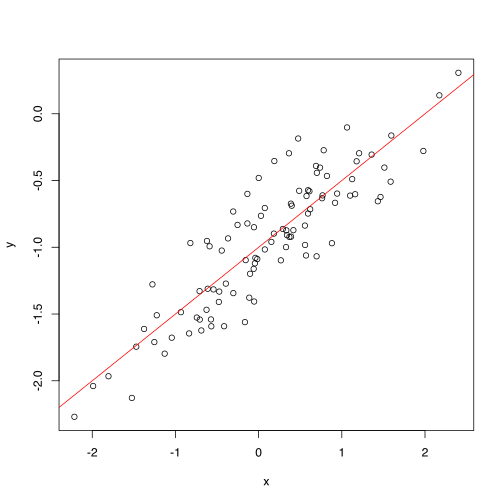


#### 13e

$\hat{\beta_0},\hat{\beta_1}$ are very close to $\beta_0,\beta_1$


```R
lm.fit1 <- lm(y~x)
summary(lm.fit)
```


    
    Call:
    lm(formula = y ~ poly(x, 2))
    
    Residuals:
         Min       1Q   Median       3Q      Max 
    -0.19650 -0.06254 -0.01288  0.05803  0.22700 
    
    Coefficients:
                Estimate Std. Error t value Pr(>|t|)    
    (Intercept) -0.94934    0.00958 -99.092   <2e-16 ***
    poly(x, 2)1  4.46754    0.09580  46.632   <2e-16 ***
    poly(x, 2)2 -0.13441    0.09580  -1.403    0.164    
    ---
    Signif. codes:  0 ‘***’ 0.001 ‘**’ 0.01 ‘*’ 0.05 ‘.’ 0.1 ‘ ’ 1
    
    Residual standard error: 0.0958 on 97 degrees of freedom
    Multiple R-squared:  0.9573,	Adjusted R-squared:  0.9565 
    F-statistic:  1088 on 2 and 97 DF,  p-value: < 2.2e-16


#### 13f


```R
plot(x,y)+abline(coef = c(-1,0.5), col="red")+abline(coef=coef(lm.fit),col="blue")
legend("bottomright",legend=c("Population Line","Least Square Line"),col=c("red","blue"),lty=c(1,1))
```


<ol class=list-inline>
</ol>


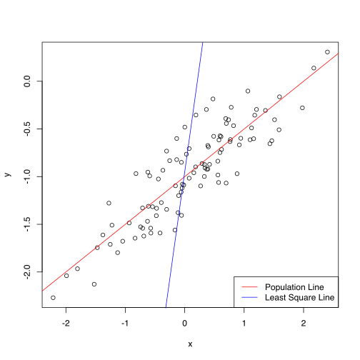


#### 13g

There is no evidence that the quadratic term improve the fit due to a lower $R^{2}$, F-statistic, and the p-value of the quadradic coefficient (> 0.05).


```R
lm.fit2 <- lm(y~poly(x,2))
summary(lm.fit)
```


    
    Call:
    lm(formula = y ~ poly(x, 2))
    
    Residuals:
         Min       1Q   Median       3Q      Max 
    -0.19650 -0.06254 -0.01288  0.05803  0.22700 
    
    Coefficients:
                Estimate Std. Error t value Pr(>|t|)    
    (Intercept) -0.94934    0.00958 -99.092   <2e-16 ***
    poly(x, 2)1  4.46754    0.09580  46.632   <2e-16 ***
    poly(x, 2)2 -0.13441    0.09580  -1.403    0.164    
    ---
    Signif. codes:  0 ‘***’ 0.001 ‘**’ 0.01 ‘*’ 0.05 ‘.’ 0.1 ‘ ’ 1
    
    Residual standard error: 0.0958 on 97 degrees of freedom
    Multiple R-squared:  0.9573,	Adjusted R-squared:  0.9565 
    F-statistic:  1088 on 2 and 97 DF,  p-value: < 2.2e-16


#### 13h


```R
set.seed(1)
x <- rnorm(100,mean = 0,sd = 1)
eps <- rnorm(100,mean = 0,sd = 0.10)
y <- -1+0.5*x+eps

lm.fit3 <- lm(y~x)
summary(lm.fit1)

lm.fit4 <- lm(y~poly(x,2))
summary(lm.fit2)


ys <- predict(lm.fit2,data.frame(x=seq(0,3,0.1)))
plot(x,y)+abline(coef = coef(lm.fit1),col="red")+lines(seq(0,3,0.1),ys,col="blue")
legend("bottomright",legend=c("Linear","Quadradic"),lty=c(1,1),col=c("red","blue"))
```


    
    Call:
    lm(formula = y ~ x)
    
    Residuals:
         Min       1Q   Median       3Q      Max 
    -0.46921 -0.15344 -0.03487  0.13485  0.58654 
    
    Coefficients:
                Estimate Std. Error t value Pr(>|t|)    
    (Intercept) -1.00942    0.02425  -41.63   <2e-16 ***
    x            0.49973    0.02693   18.56   <2e-16 ***
    ---
    Signif. codes:  0 ‘***’ 0.001 ‘**’ 0.01 ‘*’ 0.05 ‘.’ 0.1 ‘ ’ 1
    
    Residual standard error: 0.2407 on 98 degrees of freedom
    Multiple R-squared:  0.7784,	Adjusted R-squared:  0.7762 
    F-statistic: 344.3 on 1 and 98 DF,  p-value: < 2.2e-16


    
    Call:
    lm(formula = y ~ poly(x, 2))
    
    Residuals:
        Min      1Q  Median      3Q     Max 
    -0.4913 -0.1563 -0.0322  0.1451  0.5675 
    
    Coefficients:
                Estimate Std. Error t value Pr(>|t|)    
    (Intercept) -0.95501    0.02395 -39.874   <2e-16 ***
    poly(x, 2)1  4.46612    0.23951  18.647   <2e-16 ***
    poly(x, 2)2 -0.33602    0.23951  -1.403    0.164    
    ---
    Signif. codes:  0 ‘***’ 0.001 ‘**’ 0.01 ‘*’ 0.05 ‘.’ 0.1 ‘ ’ 1
    
    Residual standard error: 0.2395 on 97 degrees of freedom
    Multiple R-squared:  0.7828,	Adjusted R-squared:  0.7784 
    F-statistic: 174.8 on 2 and 97 DF,  p-value: < 2.2e-16


<ol class=list-inline>
</ol>


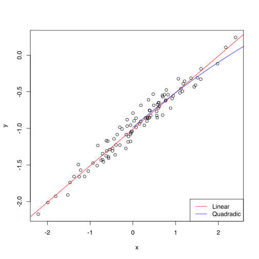


#### 13i


```R
set.seed(1)
x <- rnorm(100,mean = 0,sd = 1)
eps <- rnorm(100,mean = 0,sd = 0.80)
y <- -1+0.5*x+eps

lm.fit5 <- lm(y~x)
summary(lm.fit1)

lm.fit6 <- lm(y~poly(x,2))
summary(lm.fit2)


ys <- predict(lm.fit2,data.frame(x=seq(0,3,0.1)))
plot(x,y)+abline(coef = coef(lm.fit1),col="red")+lines(seq(0,3,0.1),ys,col="blue")
legend("bottomright",legend=c("Linear","Quadradic"),lty=c(1,1),col=c("red","blue"))
```


    
    Call:
    lm(formula = y ~ x)
    
    Residuals:
         Min       1Q   Median       3Q      Max 
    -0.46921 -0.15344 -0.03487  0.13485  0.58654 
    
    Coefficients:
                Estimate Std. Error t value Pr(>|t|)    
    (Intercept) -1.00942    0.02425  -41.63   <2e-16 ***
    x            0.49973    0.02693   18.56   <2e-16 ***
    ---
    Signif. codes:  0 ‘***’ 0.001 ‘**’ 0.01 ‘*’ 0.05 ‘.’ 0.1 ‘ ’ 1
    
    Residual standard error: 0.2407 on 98 degrees of freedom
    Multiple R-squared:  0.7784,	Adjusted R-squared:  0.7762 
    F-statistic: 344.3 on 1 and 98 DF,  p-value: < 2.2e-16


    
    Call:
    lm(formula = y ~ poly(x, 2))
    
    Residuals:
        Min      1Q  Median      3Q     Max 
    -0.4913 -0.1563 -0.0322  0.1451  0.5675 
    
    Coefficients:
                Estimate Std. Error t value Pr(>|t|)    
    (Intercept) -0.95501    0.02395 -39.874   <2e-16 ***
    poly(x, 2)1  4.46612    0.23951  18.647   <2e-16 ***
    poly(x, 2)2 -0.33602    0.23951  -1.403    0.164    
    ---
    Signif. codes:  0 ‘***’ 0.001 ‘**’ 0.01 ‘*’ 0.05 ‘.’ 0.1 ‘ ’ 1
    
    Residual standard error: 0.2395 on 97 degrees of freedom
    Multiple R-squared:  0.7828,	Adjusted R-squared:  0.7784 
    F-statistic: 174.8 on 2 and 97 DF,  p-value: < 2.2e-16


<ol class=list-inline>
</ol>


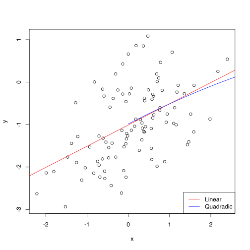


#### 13j

As the noise increases, so does the confidence intervals.


```R
confint(lm.fit3)
confint(lm.fit1)
confint(lm.fit5)
```


<table>
<thead><tr><th></th><th scope=col>2.5 %</th><th scope=col>97.5 %</th></tr></thead>
<tbody>
	<tr><th scope=row>(Intercept)</th><td>-1.0230161</td><td>-0.9845224</td></tr>
	<tr><th scope=row>x</th><td>0.4785159</td><td>0.5212720</td></tr>
</tbody>
</table>


<table>
<thead><tr><th></th><th scope=col>2.5 %</th><th scope=col>97.5 %</th></tr></thead>
<tbody>
	<tr><th scope=row>(Intercept)</th><td>-1.0575402</td><td>-0.9613061</td></tr>
	<tr><th scope=row>x</th><td>0.4462897</td><td>0.5531801</td></tr>
</tbody>
</table>


<table>
<thead><tr><th></th><th scope=col>2.5 %</th><th scope=col>97.5 %</th></tr></thead>
<tbody>
	<tr><th scope=row>(Intercept)</th><td>-1.1841286</td><td>-0.8761796</td></tr>
	<tr><th scope=row>x</th><td>0.3281271</td><td>0.6701763</td></tr>
</tbody>
</table>


### 14
#### 14a


```R
set.seed(1)
x1 = runif(100)
x2 = 0.5*x1+rnorm(100)/10
y  =2+2*x1+0.3*x2+rnorm(100)
```

The regression coefficients are $\beta_0 =2,\beta_1 =2,\beta_2 = 0.3$
#### 14b


```R
cor(x1,x2)
plot(x1,x2)
```


0.835121242463113


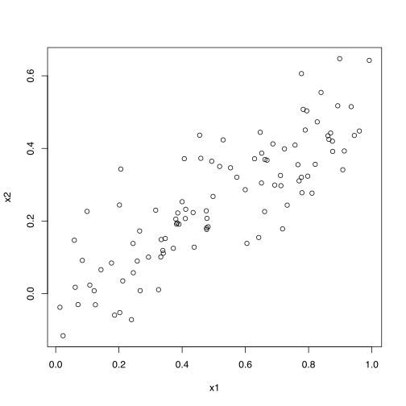


#### 14c


```R
lm.fit <- lm(y~x1+x2)
summary(lm.fit)
```


    
    Call:
    lm(formula = y ~ x1 + x2)
    
    Residuals:
        Min      1Q  Median      3Q     Max 
    -2.8311 -0.7273 -0.0537  0.6338  2.3359 
    
    Coefficients:
                Estimate Std. Error t value Pr(>|t|)    
    (Intercept)   2.1305     0.2319   9.188 7.61e-15 ***
    x1            1.4396     0.7212   1.996   0.0487 *  
    x2            1.0097     1.1337   0.891   0.3754    
    ---
    Signif. codes:  0 ‘***’ 0.001 ‘**’ 0.01 ‘*’ 0.05 ‘.’ 0.1 ‘ ’ 1
    
    Residual standard error: 1.056 on 97 degrees of freedom
    Multiple R-squared:  0.2088,	Adjusted R-squared:  0.1925 
    F-statistic:  12.8 on 2 and 97 DF,  p-value: 1.164e-05


The model coefficients are as follows; $\hat{\beta_0} = 2.13,\hat{\beta_1}=1.439,\hat{\beta_2}=1$. The null hypothesis can be rejected for $\hat{\beta_0}$ at the 5% confidence level. This is not the case for $\hat{\beta_2}$.

#### 14d


```R
lm.fit <- lm(y~x1)
summary(lm.fit)
```


    
    Call:
    lm(formula = y ~ x1)
    
    Residuals:
         Min       1Q   Median       3Q      Max 
    -2.89495 -0.66874 -0.07785  0.59221  2.45560 
    
    Coefficients:
                Estimate Std. Error t value Pr(>|t|)    
    (Intercept)   2.1124     0.2307   9.155 8.27e-15 ***
    x1            1.9759     0.3963   4.986 2.66e-06 ***
    ---
    Signif. codes:  0 ‘***’ 0.001 ‘**’ 0.01 ‘*’ 0.05 ‘.’ 0.1 ‘ ’ 1
    
    Residual standard error: 1.055 on 98 degrees of freedom
    Multiple R-squared:  0.2024,	Adjusted R-squared:  0.1942 
    F-statistic: 24.86 on 1 and 98 DF,  p-value: 2.661e-06


The null hypothesis can be rejected in this case.

#### 14e


```R
lm.fit <- lm(y~x2)
summary(lm.fit)
```


    
    Call:
    lm(formula = y ~ x2)
    
    Residuals:
         Min       1Q   Median       3Q      Max 
    -2.62687 -0.75156 -0.03598  0.72383  2.44890 
    
    Coefficients:
                Estimate Std. Error t value Pr(>|t|)    
    (Intercept)   2.3899     0.1949   12.26  < 2e-16 ***
    x2            2.8996     0.6330    4.58 1.37e-05 ***
    ---
    Signif. codes:  0 ‘***’ 0.001 ‘**’ 0.01 ‘*’ 0.05 ‘.’ 0.1 ‘ ’ 1
    
    Residual standard error: 1.072 on 98 degrees of freedom
    Multiple R-squared:  0.1763,	Adjusted R-squared:  0.1679 
    F-statistic: 20.98 on 1 and 98 DF,  p-value: 1.366e-05


The nyll hypothesis can be rejected in this case.

#### 14f

The results do not contradict each other since x1 and x2 are highly correlated. One way to interpret this is that x2 adds no new information when fitting a model that already contains x1, and vice-versa.

#### 14g


```R
x1=c(x1,0.1)
x2=c(x2,0.8)
y=c(y,6)
```


```R
lm.fit <- lm(y~x1+x2)
lm.fit1 <- lm(y~x1)
lm.fit2 <- lm(y~x2)

par(mfrow = c(2,2))
plot(lm.fit)
```


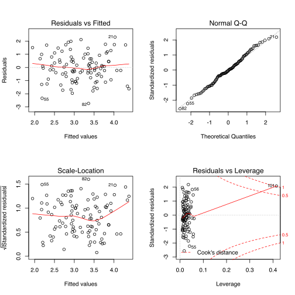


```R
par(mfrow = c(2,2))
plot(lm.fit1)
```


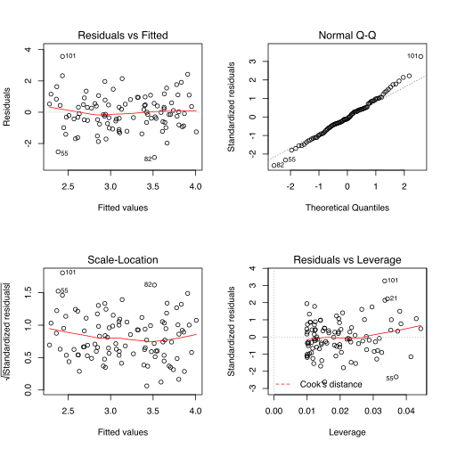


```R
par(mfrow = c(2,2))
plot(lm.fit2)
```


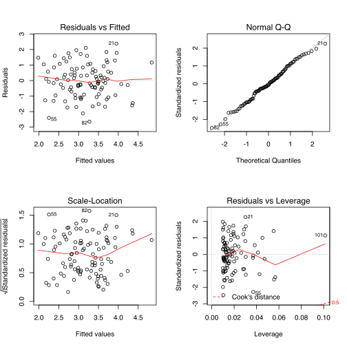


The additional observation is a point of high leverage in all 3 models, having significant influence on the model and altering the p-values. This makes it so that the same conclusions are not reached (here both null hypothesis are rejected). Only when regressing y onto x1 that evidence is present of the additional point being an outlier.

### 15


```R
library(MASS)
?Boston

Boston$chas <- as.factor(chas)
summary(Boston)
attach(Boston)
```


<table width="100%" summary="page for Boston {MASS}"><tr><td>Boston {MASS}</td><td style="text-align: right;">R Documentation</td></tr></table>

<h2>
Housing Values in Suburbs of Boston
</h2>

<h3>Description</h3>

<p>The <code>Boston</code> data frame has 506 rows and 14 columns.
</p>


<h3>Usage</h3>

<pre>
Boston
</pre>


<h3>Format</h3>

<p>This data frame contains the following columns:
</p>

<dl>
<dt><code>crim</code></dt><dd>
<p>per capita crime rate by town.
</p>
</dd>
<dt><code>zn</code></dt><dd>
<p>proportion of residential land zoned for lots over 25,000 sq.ft.
</p>
</dd>
<dt><code>indus</code></dt><dd>
<p>proportion of non-retail business acres per town.
</p>
</dd>
<dt><code>chas</code></dt><dd>
<p>Charles River dummy variable (= 1 if tract bounds river; 0 otherwise).
</p>
</dd>
<dt><code>nox</code></dt><dd>
<p>nitrogen oxides concentration (parts per 10 million).
</p>
</dd>
<dt><code>rm</code></dt><dd>
<p>average number of rooms per dwelling.
</p>
</dd>
<dt><code>age</code></dt><dd>
<p>proportion of owner-occupied units built prior to 1940.
</p>
</dd>
<dt><code>dis</code></dt><dd>
<p>weighted mean of distances to five Boston employment centres.
</p>
</dd>
<dt><code>rad</code></dt><dd>
<p>index of accessibility to radial highways.
</p>
</dd>
<dt><code>tax</code></dt><dd>
<p>full-value property-tax rate per \$10,000.
</p>
</dd>
<dt><code>ptratio</code></dt><dd>
<p>pupil-teacher ratio by town.
</p>
</dd>
<dt><code>black</code></dt><dd>
<p><i>1000(Bk - 0.63)^2</i> where <i>Bk</i> is the proportion of blacks
by town.
</p>
</dd>
<dt><code>lstat</code></dt><dd>
<p>lower status of the population (percent).
</p>
</dd>
<dt><code>medv</code></dt><dd>
<p>median value of owner-occupied homes in \$1000s.
</p>
</dd>
</dl>


<h3>Source</h3>

<p>Harrison, D. and Rubinfeld, D.L. (1978)
Hedonic prices and the demand for clean air.
<em>J. Environ. Economics and Management</em>
<b>5</b>, 81&ndash;102.
</p>
<p>Belsley D.A., Kuh, E.  and Welsch, R.E. (1980)
<em>Regression Diagnostics. Identifying Influential Data and Sources
of Collinearity.</em>
New York: Wiley.
</p>

<hr /><div style="text-align: center;">[Package <em>MASS</em> version 7.3-45 ]</div>


          crim                zn             indus       chas         nox        
     Min.   : 0.00632   Min.   :  0.00   Min.   : 0.46   0:471   Min.   :0.3850  
     1st Qu.: 0.08204   1st Qu.:  0.00   1st Qu.: 5.19   1: 35   1st Qu.:0.4490  
     Median : 0.25651   Median :  0.00   Median : 9.69           Median :0.5380  
     Mean   : 3.61352   Mean   : 11.36   Mean   :11.14           Mean   :0.5547  
     3rd Qu.: 3.67708   3rd Qu.: 12.50   3rd Qu.:18.10           3rd Qu.:0.6240  
     Max.   :88.97620   Max.   :100.00   Max.   :27.74           Max.   :0.8710  
           rm             age              dis              rad        
     Min.   :3.561   Min.   :  2.90   Min.   : 1.130   Min.   : 1.000  
     1st Qu.:5.886   1st Qu.: 45.02   1st Qu.: 2.100   1st Qu.: 4.000  
     Median :6.208   Median : 77.50   Median : 3.207   Median : 5.000  
     Mean   :6.285   Mean   : 68.57   Mean   : 3.795   Mean   : 9.549  
     3rd Qu.:6.623   3rd Qu.: 94.08   3rd Qu.: 5.188   3rd Qu.:24.000  
     Max.   :8.780   Max.   :100.00   Max.   :12.127   Max.   :24.000  
          tax           ptratio          black            lstat      
     Min.   :187.0   Min.   :12.60   Min.   :  0.32   Min.   : 1.73  
     1st Qu.:279.0   1st Qu.:17.40   1st Qu.:375.38   1st Qu.: 6.95  
     Median :330.0   Median :19.05   Median :391.44   Median :11.36  
     Mean   :408.2   Mean   :18.46   Mean   :356.67   Mean   :12.65  
     3rd Qu.:666.0   3rd Qu.:20.20   3rd Qu.:396.23   3rd Qu.:16.95  
     Max.   :711.0   Max.   :22.00   Max.   :396.90   Max.   :37.97  
          medv      
     Min.   : 5.00  
     1st Qu.:17.02  
     Median :21.20  
     Mean   :22.53  
     3rd Qu.:25.00  
     Max.   :50.00  


    The following objects are masked from Boston (pos = 3):
    
        age, black, chas, crim, dis, indus, lstat, medv, nox, ptratio, rad,
        rm, tax, zn
    


Regressing crim onto zn.


```R
lm.zn <- lm(crim~zn)
summary(lm.zn)
```


    
    Call:
    lm(formula = crim ~ zn)
    
    Residuals:
       Min     1Q Median     3Q    Max 
    -4.429 -4.222 -2.620  1.250 84.523 
    
    Coefficients:
                Estimate Std. Error t value Pr(>|t|)    
    (Intercept)  4.45369    0.41722  10.675  < 2e-16 ***
    zn          -0.07393    0.01609  -4.594 5.51e-06 ***
    ---
    Signif. codes:  0 ‘***’ 0.001 ‘**’ 0.01 ‘*’ 0.05 ‘.’ 0.1 ‘ ’ 1
    
    Residual standard error: 8.435 on 504 degrees of freedom
    Multiple R-squared:  0.04019,	Adjusted R-squared:  0.03828 
    F-statistic:  21.1 on 1 and 504 DF,  p-value: 5.506e-06


Regressing crim onto indus.


```R
lm.indus <- lm(crim~indus)
summary(lm.indus)
```


    
    Call:
    lm(formula = crim ~ indus)
    
    Residuals:
        Min      1Q  Median      3Q     Max 
    -11.972  -2.698  -0.736   0.712  81.813 
    
    Coefficients:
                Estimate Std. Error t value Pr(>|t|)    
    (Intercept) -2.06374    0.66723  -3.093  0.00209 ** 
    indus        0.50978    0.05102   9.991  < 2e-16 ***
    ---
    Signif. codes:  0 ‘***’ 0.001 ‘**’ 0.01 ‘*’ 0.05 ‘.’ 0.1 ‘ ’ 1
    
    Residual standard error: 7.866 on 504 degrees of freedom
    Multiple R-squared:  0.1653,	Adjusted R-squared:  0.1637 
    F-statistic: 99.82 on 1 and 504 DF,  p-value: < 2.2e-16


Regressing crim onto chas.


```R
lm.chas <- lm(crim~chas)
summary(lm.chas)
```


    
    Call:
    lm(formula = crim ~ chas)
    
    Residuals:
       Min     1Q Median     3Q    Max 
    -3.738 -3.661 -3.435  0.018 85.232 
    
    Coefficients:
                Estimate Std. Error t value Pr(>|t|)    
    (Intercept)   3.7444     0.3961   9.453   <2e-16 ***
    chas1        -1.8928     1.5061  -1.257    0.209    
    ---
    Signif. codes:  0 ‘***’ 0.001 ‘**’ 0.01 ‘*’ 0.05 ‘.’ 0.1 ‘ ’ 1
    
    Residual standard error: 8.597 on 504 degrees of freedom
    Multiple R-squared:  0.003124,	Adjusted R-squared:  0.001146 
    F-statistic: 1.579 on 1 and 504 DF,  p-value: 0.2094


Regressing crim onto nox.


```R
lm.nox <- lm(crim~nox)
summary(lm.nox)
```


    
    Call:
    lm(formula = crim ~ nox)
    
    Residuals:
        Min      1Q  Median      3Q     Max 
    -12.371  -2.738  -0.974   0.559  81.728 
    
    Coefficients:
                Estimate Std. Error t value Pr(>|t|)    
    (Intercept)  -13.720      1.699  -8.073 5.08e-15 ***
    nox           31.249      2.999  10.419  < 2e-16 ***
    ---
    Signif. codes:  0 ‘***’ 0.001 ‘**’ 0.01 ‘*’ 0.05 ‘.’ 0.1 ‘ ’ 1
    
    Residual standard error: 7.81 on 504 degrees of freedom
    Multiple R-squared:  0.1772,	Adjusted R-squared:  0.1756 
    F-statistic: 108.6 on 1 and 504 DF,  p-value: < 2.2e-16


Regressing crim onto rm.


```R
lm.rm <- lm(crim~rm)
summary(lm.rm)
```


    
    Call:
    lm(formula = crim ~ rm)
    
    Residuals:
       Min     1Q Median     3Q    Max 
    -6.604 -3.952 -2.654  0.989 87.197 
    
    Coefficients:
                Estimate Std. Error t value Pr(>|t|)    
    (Intercept)   20.482      3.365   6.088 2.27e-09 ***
    rm            -2.684      0.532  -5.045 6.35e-07 ***
    ---
    Signif. codes:  0 ‘***’ 0.001 ‘**’ 0.01 ‘*’ 0.05 ‘.’ 0.1 ‘ ’ 1
    
    Residual standard error: 8.401 on 504 degrees of freedom
    Multiple R-squared:  0.04807,	Adjusted R-squared:  0.04618 
    F-statistic: 25.45 on 1 and 504 DF,  p-value: 6.347e-07


Regressing crim onto age.


```R
lm.age <- lm(crim~age)
summary(lm.age)
```


    
    Call:
    lm(formula = crim ~ age)
    
    Residuals:
       Min     1Q Median     3Q    Max 
    -6.789 -4.257 -1.230  1.527 82.849 
    
    Coefficients:
                Estimate Std. Error t value Pr(>|t|)    
    (Intercept) -3.77791    0.94398  -4.002 7.22e-05 ***
    age          0.10779    0.01274   8.463 2.85e-16 ***
    ---
    Signif. codes:  0 ‘***’ 0.001 ‘**’ 0.01 ‘*’ 0.05 ‘.’ 0.1 ‘ ’ 1
    
    Residual standard error: 8.057 on 504 degrees of freedom
    Multiple R-squared:  0.1244,	Adjusted R-squared:  0.1227 
    F-statistic: 71.62 on 1 and 504 DF,  p-value: 2.855e-16


Regressing crim onto dis.


```R
lm.dis <- lm(crim~dis)
summary(lm.dis)
```


    
    Call:
    lm(formula = crim ~ dis)
    
    Residuals:
       Min     1Q Median     3Q    Max 
    -6.708 -4.134 -1.527  1.516 81.674 
    
    Coefficients:
                Estimate Std. Error t value Pr(>|t|)    
    (Intercept)   9.4993     0.7304  13.006   <2e-16 ***
    dis          -1.5509     0.1683  -9.213   <2e-16 ***
    ---
    Signif. codes:  0 ‘***’ 0.001 ‘**’ 0.01 ‘*’ 0.05 ‘.’ 0.1 ‘ ’ 1
    
    Residual standard error: 7.965 on 504 degrees of freedom
    Multiple R-squared:  0.1441,	Adjusted R-squared:  0.1425 
    F-statistic: 84.89 on 1 and 504 DF,  p-value: < 2.2e-16


Regressing crim onto rad.


```R
lm.rad <- lm(crim~rad)
summary(lm.rad)
```


    
    Call:
    lm(formula = crim ~ rad)
    
    Residuals:
        Min      1Q  Median      3Q     Max 
    -10.164  -1.381  -0.141   0.660  76.433 
    
    Coefficients:
                Estimate Std. Error t value Pr(>|t|)    
    (Intercept) -2.28716    0.44348  -5.157 3.61e-07 ***
    rad          0.61791    0.03433  17.998  < 2e-16 ***
    ---
    Signif. codes:  0 ‘***’ 0.001 ‘**’ 0.01 ‘*’ 0.05 ‘.’ 0.1 ‘ ’ 1
    
    Residual standard error: 6.718 on 504 degrees of freedom
    Multiple R-squared:  0.3913,	Adjusted R-squared:   0.39 
    F-statistic: 323.9 on 1 and 504 DF,  p-value: < 2.2e-16


Regressing crim onto tax.


```R
lm.tax <- lm(crim~tax)
summary(lm.tax)
```


    
    Call:
    lm(formula = crim ~ tax)
    
    Residuals:
        Min      1Q  Median      3Q     Max 
    -12.513  -2.738  -0.194   1.065  77.696 
    
    Coefficients:
                 Estimate Std. Error t value Pr(>|t|)    
    (Intercept) -8.528369   0.815809  -10.45   <2e-16 ***
    tax          0.029742   0.001847   16.10   <2e-16 ***
    ---
    Signif. codes:  0 ‘***’ 0.001 ‘**’ 0.01 ‘*’ 0.05 ‘.’ 0.1 ‘ ’ 1
    
    Residual standard error: 6.997 on 504 degrees of freedom
    Multiple R-squared:  0.3396,	Adjusted R-squared:  0.3383 
    F-statistic: 259.2 on 1 and 504 DF,  p-value: < 2.2e-16


Regressing crim onto ptratio.


```R
lm.ptratio <- lm(crim~ptratio)
summary(lm.ptratio)
```


    
    Call:
    lm(formula = crim ~ ptratio)
    
    Residuals:
       Min     1Q Median     3Q    Max 
    -7.654 -3.985 -1.912  1.825 83.353 
    
    Coefficients:
                Estimate Std. Error t value Pr(>|t|)    
    (Intercept) -17.6469     3.1473  -5.607 3.40e-08 ***
    ptratio       1.1520     0.1694   6.801 2.94e-11 ***
    ---
    Signif. codes:  0 ‘***’ 0.001 ‘**’ 0.01 ‘*’ 0.05 ‘.’ 0.1 ‘ ’ 1
    
    Residual standard error: 8.24 on 504 degrees of freedom
    Multiple R-squared:  0.08407,	Adjusted R-squared:  0.08225 
    F-statistic: 46.26 on 1 and 504 DF,  p-value: 2.943e-11


Regressing crim onto black.


```R
lm.black <- lm(crim~black)
summary(lm.black)
```


    
    Call:
    lm(formula = crim ~ black)
    
    Residuals:
        Min      1Q  Median      3Q     Max 
    -13.756  -2.299  -2.095  -1.296  86.822 
    
    Coefficients:
                 Estimate Std. Error t value Pr(>|t|)    
    (Intercept) 16.553529   1.425903  11.609   <2e-16 ***
    black       -0.036280   0.003873  -9.367   <2e-16 ***
    ---
    Signif. codes:  0 ‘***’ 0.001 ‘**’ 0.01 ‘*’ 0.05 ‘.’ 0.1 ‘ ’ 1
    
    Residual standard error: 7.946 on 504 degrees of freedom
    Multiple R-squared:  0.1483,	Adjusted R-squared:  0.1466 
    F-statistic: 87.74 on 1 and 504 DF,  p-value: < 2.2e-16


Regressing crim onto lstat.


```R
lm.lstat <- lm(crim~lstat)
summary(lm.lstat)
```


    
    Call:
    lm(formula = crim ~ lstat)
    
    Residuals:
        Min      1Q  Median      3Q     Max 
    -13.925  -2.822  -0.664   1.079  82.862 
    
    Coefficients:
                Estimate Std. Error t value Pr(>|t|)    
    (Intercept) -3.33054    0.69376  -4.801 2.09e-06 ***
    lstat        0.54880    0.04776  11.491  < 2e-16 ***
    ---
    Signif. codes:  0 ‘***’ 0.001 ‘**’ 0.01 ‘*’ 0.05 ‘.’ 0.1 ‘ ’ 1
    
    Residual standard error: 7.664 on 504 degrees of freedom
    Multiple R-squared:  0.2076,	Adjusted R-squared:  0.206 
    F-statistic:   132 on 1 and 504 DF,  p-value: < 2.2e-16


Regressing crim onto medv.


```R
lm.medv <- lm(crim~medv)
summary(lm.medv)
```


    
    Call:
    lm(formula = crim ~ medv)
    
    Residuals:
       Min     1Q Median     3Q    Max 
    -9.071 -4.022 -2.343  1.298 80.957 
    
    Coefficients:
                Estimate Std. Error t value Pr(>|t|)    
    (Intercept) 11.79654    0.93419   12.63   <2e-16 ***
    medv        -0.36316    0.03839   -9.46   <2e-16 ***
    ---
    Signif. codes:  0 ‘***’ 0.001 ‘**’ 0.01 ‘*’ 0.05 ‘.’ 0.1 ‘ ’ 1
    
    Residual standard error: 7.934 on 504 degrees of freedom
    Multiple R-squared:  0.1508,	Adjusted R-squared:  0.1491 
    F-statistic: 89.49 on 1 and 504 DF,  p-value: < 2.2e-16


It can be noted from all the linear models above that there is no evidence that chas and age are associated with crim, and there is evidence of association between the remaining predictors and crim. 

#### 15b


```R
lm.all <- lm(crim~.,data=Boston)
summary(lm.all)
```


    
    Call:
    lm(formula = crim ~ ., data = Boston)
    
    Residuals:
       Min     1Q Median     3Q    Max 
    -9.924 -2.120 -0.353  1.019 75.051 
    
    Coefficients:
                  Estimate Std. Error t value Pr(>|t|)    
    (Intercept)  17.033228   7.234903   2.354 0.018949 *  
    zn            0.044855   0.018734   2.394 0.017025 *  
    indus        -0.063855   0.083407  -0.766 0.444294    
    chas1        -0.749134   1.180147  -0.635 0.525867    
    nox         -10.313535   5.275536  -1.955 0.051152 .  
    rm            0.430131   0.612830   0.702 0.483089    
    age           0.001452   0.017925   0.081 0.935488    
    dis          -0.987176   0.281817  -3.503 0.000502 ***
    rad           0.588209   0.088049   6.680 6.46e-11 ***
    tax          -0.003780   0.005156  -0.733 0.463793    
    ptratio      -0.271081   0.186450  -1.454 0.146611    
    black        -0.007538   0.003673  -2.052 0.040702 *  
    lstat         0.126211   0.075725   1.667 0.096208 .  
    medv         -0.198887   0.060516  -3.287 0.001087 ** 
    ---
    Signif. codes:  0 ‘***’ 0.001 ‘**’ 0.01 ‘*’ 0.05 ‘.’ 0.1 ‘ ’ 1
    
    Residual standard error: 6.439 on 492 degrees of freedom
    Multiple R-squared:  0.454,	Adjusted R-squared:  0.4396 
    F-statistic: 31.47 on 13 and 492 DF,  p-value: < 2.2e-16


At the 5% confidence level, the null hypothesis can be rejected for the predictors; zn, dis, rad, black, and medv.

#### 15c

The results are different when fitting a model using all the predictors; In this case, there is no evidence of additional predictors (other than chas, and age) being associated with crim. The only predictors were the null hypothesis can be refuted are zn, dis, rad, black and medv.


```R
xs <- c(coef(lm.zn)[2],coef(lm.indus)[2],coef(lm.chas)[2],coef(lm.nox)[2],coef(lm.rm)[2],coef(lm.age)[2],coef(lm.dis)[2],coef(lm.rad)[2],coef(lm.tax)[2],coef(lm.ptratio)[2],coef(lm.black)[2],coef(lm.lstat)[2],coef(lm.medv)[2])
ys <- coef(lm.all)[-1]

data.frame(xs,ys)
plot(xs,ys)
```


<table>
<thead><tr><th></th><th scope=col>xs</th><th scope=col>ys</th></tr></thead>
<tbody>
	<tr><th scope=row>zn</th><td>-0.07393498</td><td>0.04485521</td></tr>
	<tr><th scope=row>indus</th><td>0.5097763</td><td>-0.06385482</td></tr>
	<tr><th scope=row>chas1</th><td>-1.892777</td><td>-0.7491336</td></tr>
	<tr><th scope=row>nox</th><td>31.24853</td><td>-10.31353</td></tr>
	<tr><th scope=row>rm</th><td>-2.684051</td><td>0.4301305</td></tr>
	<tr><th scope=row>age</th><td>0.1077862</td><td>0.001451643</td></tr>
	<tr><th scope=row>dis</th><td>-1.550902</td><td>-0.9871757</td></tr>
	<tr><th scope=row>rad</th><td>0.6179109</td><td>0.5882086</td></tr>
	<tr><th scope=row>tax</th><td>0.02974225</td><td>-0.003780016</td></tr>
	<tr><th scope=row>ptratio</th><td>1.151983</td><td>-0.2710806</td></tr>
	<tr><th scope=row>black</th><td>-0.03627964</td><td>-0.007537505</td></tr>
	<tr><th scope=row>lstat</th><td>0.5488048</td><td>0.1262114</td></tr>
	<tr><th scope=row>medv</th><td>-0.3631599</td><td>-0.1988868</td></tr>
</tbody>
</table>


#### 15d


```R
lm.zn3 <- lm(crim~poly(zn,3))
summary(lm.zn3) # No evidence for cubic term.
```


    
    Call:
    lm(formula = crim ~ poly(zn, 3))
    
    Residuals:
       Min     1Q Median     3Q    Max 
    -4.821 -4.614 -1.294  0.473 84.130 
    
    Coefficients:
                 Estimate Std. Error t value Pr(>|t|)    
    (Intercept)    3.6135     0.3722   9.709  < 2e-16 ***
    poly(zn, 3)1 -38.7498     8.3722  -4.628  4.7e-06 ***
    poly(zn, 3)2  23.9398     8.3722   2.859  0.00442 ** 
    poly(zn, 3)3 -10.0719     8.3722  -1.203  0.22954    
    ---
    Signif. codes:  0 ‘***’ 0.001 ‘**’ 0.01 ‘*’ 0.05 ‘.’ 0.1 ‘ ’ 1
    
    Residual standard error: 8.372 on 502 degrees of freedom
    Multiple R-squared:  0.05824,	Adjusted R-squared:  0.05261 
    F-statistic: 10.35 on 3 and 502 DF,  p-value: 1.281e-06


```R
lm.indus3 <- lm(crim~poly(indus,3))
summary(lm.indus3) # Evidence of non linearity.
```


    
    Call:
    lm(formula = crim ~ poly(indus, 3))
    
    Residuals:
       Min     1Q Median     3Q    Max 
    -8.278 -2.514  0.054  0.764 79.713 
    
    Coefficients:
                    Estimate Std. Error t value Pr(>|t|)    
    (Intercept)        3.614      0.330  10.950  < 2e-16 ***
    poly(indus, 3)1   78.591      7.423  10.587  < 2e-16 ***
    poly(indus, 3)2  -24.395      7.423  -3.286  0.00109 ** 
    poly(indus, 3)3  -54.130      7.423  -7.292  1.2e-12 ***
    ---
    Signif. codes:  0 ‘***’ 0.001 ‘**’ 0.01 ‘*’ 0.05 ‘.’ 0.1 ‘ ’ 1
    
    Residual standard error: 7.423 on 502 degrees of freedom
    Multiple R-squared:  0.2597,	Adjusted R-squared:  0.2552 
    F-statistic: 58.69 on 3 and 502 DF,  p-value: < 2.2e-16


```R
# chas is qualitative predictor, polynomial does not make sense in this case.
```
